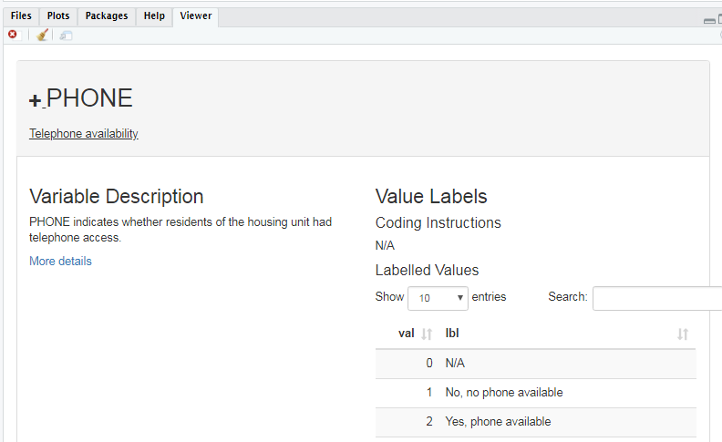

```{r setup, include=FALSE}
knitr::opts_chunk$set(
  echo = TRUE, 
  collapse = TRUE,
  comment = "#>"
)

hook_source <- knitr::knit_hooks$get('source')
knitr::knit_hooks$set(source = function(x, options) {
  x <- gsub(
    "^[[:blank:]]?([^*].+?)[[:blank:]]*#<<[[:blank:]]*$", 
    "*\\1", 
    x,
    perl = TRUE
  )
  hook_source(x, options)
})

options(width = 50)
```

<style>
.derek-pet {
  background-color: #000000;
  background-image: url(logos/derek2.jpg);
  background-size: cover;
  width: 120px;
  height: 160px;
  position: absolute;
  left: 125px;
  top: 150px;
}
</style>


<style>
.dan-pet1 {
  background-color: #d3d3d3;
  background-image: url(logos/felix.jpg);
  background-size: cover;
  width: 120px;
  height: 160px;
  position: absolute;
  left: 305px;
  top: 225px;
  
}
</style>


<style>
.dan-pet2 {
  background-color: #000000;
  background-image: url(logos/luna.jpg);
  background-size: cover;
  width: 120px;
  height: 120px;  
  position: absolute;
  left: 450px;
  top: 250px;
}
</style>


<style>
.grid-logo {
  background-image: url(logos/grid.png);
  background-size: cover;
  width: 400px;
  height: 400px;
  position: absolute;
  right: 75px;

}
</style>


<style>
.isrdi-logo {
  background-image: url(logos/isrdi2.jpg);
  background-size: cover;
  height: 186px;
  width: 604px;
  position: absolute;
  bottom: 15px;
  left: 15;
}
</style>


<style>
.names {
  font-size: 1.5em;
}
</style>

<style>
  .greyed-out {
    color: #D3D3D3;
    text-indent: 20px;
  }
</style>

<style>
  .strong {
    color: #000000;
    text-indent: 20px;
  }
</style>

# Who we are


.isrdi-logo[

]

--

.left[
Derek Burk, PhD 

Sociology
]

--

.center[
Dan Ehrlich, MA

Anthropology


]

--

.right[


Kara Fisher,
MPH

Public Health

]


???
(Name, pronouns, academic field, time with IPUMS)

So, my name is Derek Burk, I use he/him pronouns, I've been working on the
IPUMS International team for the past four years, and my academic training is in
sociology.


---

# Who we are

.isrdi-logo[]


.derek-pet[

]

.dan-pet1[]

.dan-pet2[]

.kara-pet[]


<style>
.kara-pet {
  background-color: #000000;
  background-image: url(logos/Ru.jpg);
  background-size: cover;
  width: 140px;
  height: 160px;
  position: absolute;
  left: 650px;
  bottom: 200px;
}
</style>


???

Rather than our faces, we thought everyone would appreciate pets.

**A FEW NOTES**

This presentation will be recorded and will be available along with slides so don't worry about trying to take notes.

You can always reach out to through our **github**, or via **user support**.

---

# Overview

1. What is IPUMS?

--

2. What is ipumsr, and why use it?

--

3. Reading data into R

--

4. Exploring and manipulating metadata

--

5. Brief analysis example

--

6. Working with IPUMS geographic data

--

7. Preview of IPUMS API functionality

--

8. Q & A

---

# Overview


.greyed-out[


.strong[`1.` What is IPUMS?]

`2.` What is ipumsr, and why use it?

`3.` Reading data into R

`4.` Exploring and manipulating metadata

`5.` Brief analysis example

`6.` Working with IPUMS geographic data

`7.` Preview of IPUMS API functionality

`8.` Q & A

]


---


class: center

# What is IPUMS?

--

## IPUMS is **data**

--

## from censuses and surveys around the world,

--

## integrated across space and time,

--

## thoroughly documented,

--

## and available for free at ipums.org

???


ipums has grown substantially since its first beta release in 1993, 

started with **US census data** has grown to include 9 collections

*mostly just segueing to projects*

---

class: center, middle

# Poll: Which IPUMS data collections have you used already?


---
# 


--

- U.S. Census and American Community Survey **microdata** from 1850 to the present.

- 180,755,919 unique person records from decennial census and American Community Survey.

- 191,983,898 historical person records from full count decennial census from 1850-1940 (1890 census lost due to fire).

- https://usa.ipums.org/usa/

???


---
# 


--

- Current Population Survey **microdata** from 1962 to the present.

- Monthly labor force surveys and supplements.

- https://cps.ipums.org/cps/

---
# 


--


- Census **microdata** covering 102 countries from 1960 to the present 


- International historic **microdata** from the 19th and early 20th centuries for *9* countries.

--

- Labor Force surveys provide high resolution **microdata** about work conditions

  - Administered quarterly (usually) with records going back at least 10 years (usually)
  - Currently available for Italy (2011-2020) & Spain (2005-2020)
  - Mexico (2005-2020) coming soon!

- https://international.ipums.org/international/


---
# 


--


- Demographic and Health Surveys (DHS) provide integrated **microdata** for analysis across time and space.
  - From the 1980s to the present.
  - Covering Africa and South Asia
  
- Performance Monitoring for Action (PMA) surveys
  - Focus on fertility, contraception, hygiene, and health
  - Administered frequently to monitor trends in select high-fertility countries.
  - https://ipums.github.io/pma-data-hub/index.html#category:PMA_Publications

- https://globalhealth.ipums.org/

???

Check out Matt Gunther's blog using IPUMS Global Health Data

---
# 


--


- Health **survey** data from the National Health Interview Survey (NHIS) from the 1960s to the present and the Medical Expenditure Panel Survey (MEPS) from 1996.

- Supplements on cost of healthcare.

- https://healthsurveys.ipums.org/
???


---
# 


--


- Scientists and Engineers Statistical Data System (SESTAT), the leading surveys for studying the science and engineering (STEM) workforce in the United States

- Data from the National Surveys of College Graduates (NSCG), Recent College Graduates (NSRCG) and Doctorate Recipients (SDR) are integrated from 1993 to the present.

- https://highered.ipums.org/highered/


---
# 


--

- Historical and contemporary time use data from 1965 to the present.

- Extensive time diary data from respondents in the US and *7* other countries.

- https://timeuse.ipums.org/

---
# 


--

- Summary tables and time series of population, housing, agriculture, and economic data 

- GIS Shapefiles for all levels of US geography, including tracts, from 1790 to the present

- https://www.nhgis.org/


---
# 


--

- **Summary** data tables from population and housing censuses as well as agricultural censuses from around the world

- Integrated GIS **shapefiles.**

- https://ihgis.ipums.org/


---

class: center, middle

# Poll: Which IPUMS data collections are you most excited to use in the future ?

---

# So what is IPUMS?


.grid-logo[

]

.pull-left[
- IPUMS is **a lot** of data

- United in consistently documented metadata
]


???

So ipums really is **data** and a whole lot of it. These 9 different projects interact with different types of data and at different scales but they are united in the use of metadata that helps contextualize the data

*So I know you're asking yourselves..*
---

# So what is IPUMS?


.grid-logo[

]


.pull-left[
- IPUMS is **a lot** of data

- United in consistently documented metadata

- *What's the best way to interact with IPUMS data?*
]


???


---


# Overview

.greyed-out[


`1.` What is IPUMS?

.strong[`2.` What is ipumsr, and why use it?]

`3.` Reading data into R

`4.` Exploring and manipulating metadata

`5.` Brief analysis example

`6.` Working with IPUMS geographic data

`7.` Preview of IPUMS API functionality

`8.` Q & A

]


---


# What is ipumsr?

<style>
.ipumsr-logo {
  background-image: url(logos/ipumsr.png);
  background-size: cover;
  height: 298px;
  width: 257px;
  position: absolute;
  right: 50px;
  bottom: 50px;
}
</style>


.ipumsr-logo[

]

- R package developed by Greg Freedman Ellis

--

- Released in 2017


--

- Over 90,000 CRAN downloads

--

- Includes functions for
  - Reading IPUMS data
  - Exploring and manipulating IPUMS metadata
  - **SOON**: Interacting with the IPUMS API
    
    
???
(Metadata such as value labels, variable labels, and detailed variable 
descriptions.)

Initial API support will be for IPUMS USA, with more projects to follow soon.


---

# Why use ipumsr?

- One package for IPUMS microdata, aggregate data, and geography

???

Regarding "One package": Without ipumsr, you'd need to use a variety of
different approaches from different packages to read in and explore IPUMS


**microdata** from IPUMS: USA, CPS, and International, IPUMS

**aggregate data** (from NHGIS or IHGIS), 
and **IPUMS shapefiles**. ipumsr provides one
package with a consistent interface for working with all these different types
of IPUMS data.

*a one stop shop that makes it easy to work with ipums data*
---

class: center middle inverse
background-image: url(https://comicvine.gamespot.com/a/uploads/original/5/52246/1963701-the_one_ring_02.jpg)
background-size: cover

<span role="img" aria-label="Slide background shows: The 'One Ring' from The Lord of the Rings set on a fiery background."></span>

# One package to rule them all


```{r echo=FALSE, fig.alt="Slide background shows: The 'One Ring' from The Lord of the Rings set on a fiery background."}

```

---

# Why use ipumsr?

- One package for IPUMS microdata, aggregate data, and geography

- Specialized functions for viewing and manipulating IPUMS metadata

--

- Bundled how-to guides (vignettes)

--

- Potential to add more features (e.g. API support); let us know what you want!
  - File an issue at https://github.com/mnpopcenter/ipumsr/issues
  - Email ipums+cran@umn.edu

???
Regarding "More features": The aforementioned IPUMS API support will be the next
big feature. Another potential new feature is adding tools for properly handling
survey weights. Let us know what would be helpful to you via GitHub or email.

---

# Why use ipumsr?

And finally... 

--

- It's fast!
  - Time to read 3 million rows with 13 variables:

```{r, echo=FALSE}
results <- readRDS("ipumsr_speed_test.rds")
suppressPackageStartupMessages({
  library(dplyr)
  suppressWarnings(library(gt))
})
results %>% 
  arrange(time) %>% 
  mutate(time = round(time, 1)) %>% 
  rename(`Function` = function_name, `Time (seconds)` = time, 
         `With metadata?` = value_labels) %>% 
  gt() %>% 
  # tab_header("How long to read 3 million rows with 13 variables?") %>% 
  cols_align("center", c(`Time (seconds)`, `With metadata?`))
```

???
There are other ways to read IPUMS data into R, but ipumsr is the fastest way 
to read the data in with attached metadata, such as variable and value labels.

Relatively small example, so the time costs can grow with larger datasets.
---

class: center, middle

# Poll: Have you ever used ipumsr before?

???
If you've never used ipumsr before you may be asking *where can i download it*


---

# Installing ipumsr
```{r, eval = FALSE}
install.packages("ipumsr")
```

--

### Or if you want the development version

- www.github.com/mnpopcenter/ipumsr

```{r, eval = FALSE}
if (!require(remotes)) install.packages("remotes")
remotes::install_github("mnpopcenter/ipumsr", ref = "api-alpha-dev")
```

???

More advanced users might be thinking, *"this stable release is boring"* in which case you can download the development version to test out the latest features. 

The API functions are in the development version, but the API itself is not yet 
publicly available.

---
class: center, middle

# To run the code in this webinar

???

Repeat: slides/recording will be available. To run this code yourself you can clone/download the repo from our github. This provides the data extracts you'll need. 

However, you may need to install some additional packages used in the example code below, as shown on the next slide.

---


# Install R packages (as needed)

```{r, eval = FALSE}


# install.packages(ipumsr)

## Tidyverse
install.packages("dplyr")
install.packages("ggplot2")
install.packages("stringr")
install.packages("purrr")

## HTML tables
install.packages("DT")

## gis
install.packages("sf")
```

???

reminder, installing packages only needs to happen once, but some packages do update frequently so it can be a good idea to re-install once in a while

---


# Loading packages
```{r eval=FALSE}
library(ipumsr)
library(dplyr)
library(ggplot2)
library(stringr)
library(sf)
library(purrr)
```

```{r include=FALSE}
library(ipumsr)
library(dplyr)
library(ggplot2)
library(stringr)
library(sf)
library(purrr)
```

???
These packages are used in some of the examples we will walk through.

---


# Overview

.greyed-out[


`1.` What is IPUMS?

`2.` What is ipumsr, and why use it?

.strong[`3.` Reading data into R]

`4.` Exploring and manipulating metadata

`5.` Brief analysis example

`6.` Working with IPUMS geographic data

`7.` Preview of IPUMS API functionality

`8.` Q & A

]


???

Dan passes to Kara/Derek

---

# Downloading your data extract

```{r echo=FALSE, fig.alt="Screenshot of IPUMS data download page with overlaid instructions: 1. Click the 'Download .DAT' link to download the data. 2. Right click the 'DDI' link. 3. In the right-click menu, choose 'Save link as' in Firefox or Chrome, or 'Download Linked File' in Safari."}
knitr::include_graphics("screenshots/microdata_annotated_screenshot.png")
```

--

- You must download both the data and DDI codebook

- Save both files in the same folder

???

Kind of confusing how to save the DDI/.xml file. THIS IS HOW.
DDI is EXTREMELY important, as it contains all the instructions regarding the METADATA

Once your extract is complete, download the data file and the DDI. Downloading
the DDI is a little bit different depending on your browser. On most browsers
you should right-click the file and select “Save As…”. If this saves a file with
a .xml file extension, then you should be ready. However, Safari users must
select “Download Linked File” instead of “Download Linked File As”. On Safari,
selecting the wrong version of these two will download a file with a .html file
extension instead of a .xml extension.

In case anyone was curious, DDI stands for "Data Documentation Initiative" --
the DDI project sets standards for documenting datasets, and the codebooks for
most IPUMS projects follow this standard.

Make sure to save the data and DDI files in the same location.

---

# Downloading your data extract

- Optional: "R" link contains code to read in your data with ipumsr

```{r echo=FALSE, fig.alt="Screenshot of IPUMS data download page with the 'R' link highlighted"}
knitr::include_graphics("screenshots/download_screenshot_2.png")
```


???
The links under "Command Files" contain program-specific code for reading in the
data. The R one contains the code we'll show on the next slide.

This helper code checks that you have ipumsr installed, and if you do, it reads
in the DDI codebook and data into separate objects. 

---

# Read in the data

- Using functions `read_ipums_ddi()` and `read_ipums_micro()`
```{r}
ddi <- read_ipums_ddi("usa_00013.xml")

data <- read_ipums_micro(ddi)
```

--

- This also works:

```{r}
data <- read_ipums_micro("usa_00013.xml")
```

- Note: supply the codebook, *not* the data file, to `read_ipums_micro()`

???
So you've downloaded both the data and the DDI codebook, and saved them in the 
same folder. Here's how you actually read the data into R.

The first option, and the one I'd recommend, is to read the DDI codebook into an 
object named "ddi" using the `read_ipums_ddi()` function, and then supply that 
ddi object to `read_ipums_micro()`.

The second option is to read in the data by passing the file path to the DDI
codebook to the `read_ipums_micro()` function. However, we recommend the first
pattern because it's often helpful to save the codebook to it's own object to
preserve the original metadata once you start messing around with the data.

Notice that in both cases we are supplying the codebook (either already read in
or as a file path), not the data file, to `read_ipums_micro()`. The fact that we
don't point to the actual data file when reading in the data might confusing. If
I want to read in the data shouldn't I point to the data file? The reason for
this is that the codebook includes the path

---

class: center middle

# Why do I point to the codebook to read in the data?

--

### The data file is **dumb**, the codebook is **smart**

???
Here's my attempt to explain this in a hopefully memorable way: the data file is
dumb, and the codebook is smart

---

# The data file is dumb

```{r echo=FALSE, comment = ''}
readLines("usa_00013.dat.gz", n = 10) %>% 
  paste0(collapse = "\n") %>% 
  cat()
```
???
Looking at the first ten lines of our example data file, it makes sense why you 
can't just tell R "read this data file into a data.frame". The data file itself
doesn't contain any information about what the variables are called or which 
numbers on each line correspond to which variables, let alone what the meaning 
of those values might be.

(In case you're wondering what those blanks are, that's a geography variable 
that is not available in some years of our data.)

---

# The DDI codebook is smart

```{r, results='markup'}
names(ddi)
```
--

```{r}
ddi$file_name
```

???
The DDI codebook is the brains of the operation. It contains a bunch of
information about your extract, including the name of the data file, which is 
why you don't need to supply the path to the data file if you saved the codebook 
and data in the same folder.

But perhaps the most important element for understanding and analyzing the data
is the "var_info" element, so let's take a look at that.

---

# The DDI codebook is smart

```{r echo=FALSE}
old_width <- getOption("width")
options(width = 150)
```


```{r}
ddi$var_info
```

```{r echo=FALSE}
options(width = old_width)
```

???
As we can see here, var_info is just data.frame where each row has information 
about one variable, including the variable name, label, description, and value 
labels, as well as where the variable is located in the fixed-width file.

You don't need to remember the details of what's in the DDI object or this 
var_info data.frame, as long as you remember that to read in the data, you must 
point to the DDI codebook, not the data file.

---

# Overview

.greyed-out[


`1.` What is IPUMS?

`2.` What is ipumsr, and why use it?

`3.` Reading data into R

.strong[`4.` Exploring and manipulating metadata]

`5.` Brief analysis example

`6.` Working with IPUMS geographic data

`7.` Preview of IPUMS API functionality

`8.` Q & A

]

---

# What's in my extract again?

--

Maybe I wrote an informative extract description?

```{r include=FALSE}
ddi$extract_notes <- 
  paste0(
    "User-provided description: Revision of(Revision of(Revision of(Revision ", 
    "of(my extract))))"
  )
```

```{r}
ddi$extract_notes %>% strwrap(60)
```

--

No such luck 😞

???
So we've read in our data -- how do we go about exploring it?

We could refer back to the description we wrote when creating the extract, 
maybe that will be informative. Let's see (read extract description). Ooh, 
that's not very helpful. I'm guessing this joke hits close to home for some of 
you long-time IPUMS users.

---

# What's in my extract again?

We can print the names of our variables:

--

```{r}
names(data)
```


But often variable names aren't self-explanatory.

--

Let's leverage that attached metadata!

???
[Read text on slides]

---

# Available metadata

Variable labels and descriptions:

```{r}
ipums_var_label(ddi, PHONE)

ipums_var_desc(ddi, PHONE) %>% strwrap(60)
```

???
So you can see here that ipumsr provides function to extract information from 
the DDI object without the need to slice and dice that "var_info" data.frame I 
showed before. Here we grab the label and description for the variable PHONE.

---

# Available metadata

Value labels:

```{r}
ipums_val_labels(ddi, PHONE)
```

???
Similarly, we can print the value labels by pointing to the DDI. We see here 
that the variable PHONE takes four values: no, yes, not applicable, and 
suppressed.

---


# An interactive view of metadata

```{r, eval=FALSE}
ipums_view(ddi)
```

```{r echo=FALSE, fig.alt="Screenshot of static html page generated by function 'ipums_view', showing variable label and variable description for the variable 'PHONE'.", fig.height=3, fig.width=5}

```

???
For a more browsable view of the metadata, the ipums_view() function makes a
nicely-formatted static html page that allows you to browse the metadata
associated with your data extract.


---

# Wrangling value labels

- IPUMS value labels don't translate perfectly to R factors

    - Every value in a factor must be labeled
    
    - Factor values always count up from 1

--

- `ipumsr` uses `haven::labelled()` objects to preserve values and labels, but 
  these objects can be tricky to work with
  
--

- ipumsr helper functions allow you to leverage info from values and labels

```{r, include = FALSE}
label_before_after <- function(df, before_var, after_var, label_fun) {
  before_var <- rlang::enquo(before_var)
  after_var <- rlang::enquo(after_var)

  
  freqs <- df %>% 
    mutate(val = !!before_var) %>%
    group_by(val) %>%
    summarize(count = n()) 
  
  all_vals <- ipums_val_labels(df, !!before_var) %>% pull(val)
  attributes(all_vals) <- attributes(df %>% pull(!!before_var))
  
  unique_val_df <- dplyr::tibble(val = all_vals) %>%
    mutate(
      after = label_fun(val),
      `before ([val] label)` = as_factor(val, "both")
    ) %>%
    filter(after %in% levels(df %>% pull(!!after_var)) | is.na(after))
  
  attributes(unique_val_df$val) <- NULL
  attributes(freqs$val) <- NULL
  
  out <- left_join(unique_val_df, freqs, by = "val") %>%
    mutate(count = ifelse(is.na(count), 0, count)) %>%
    select(`before ([val] label)`, after, count)
  
  out %>%
    DT::datatable(
      rownames = FALSE, 
      filter = "none", 
      options = list(
        searching = FALSE, 
        scrollY = "200px",
        scrollCollapse = TRUE,
        paging = FALSE,
        bInfo = FALSE
      )
    )
}
```

???
IPUMS value labels don't translate perfectly to R factors. The most important 
difference is that in a factor, values always count up from 1. In IPUMS 
variables, the values themselves often encode meaningful information about a 
nested structure, which we'll see with the education variable below.
  
To preserve both the value and label, `ipumsr` imports labelled variables as
`haven::labelled()` objects, but these aren't always the easiest to deal with, 
because they aren't widely supported by functions from base R and other 
packages. Thus, you will almost always want to convert these objects to 
something like a factor or a regular numeric or character vector.

Luckily ipumsr provides helpers that allow you to use information from both the
value and label to transform your variables into the shape you want.

---

# haven::labelled columns at a glance

```{r echo=FALSE}
old_width <- getOption("width")
options(width = 150)
```

```{r}
data
```

???
Here's what the data look like when you read them in.


One thing I like about the behavior of `haven::labelled()` objects is how they 
show the value and the label when you print your data. 

But let's say you just don't want to deal with these special haven::labelled
objects, and you want to get rid of them in one fell swipe. I would advise
against this approach in general, but it could be what you want in some cases.

---

# Get rid of haven::labelled columns

```{r}
as_factor(data)
```

???
One option is the `as_factor()` function, which can be applied to the whole data 
frame at once. Here we see that the values have been stripped away, leaving only 
the labels as factor levels.

---

# Get rid of haven::labelled columns

```{r}
zap_labels(data)
```

```{r echo=FALSE}
options(width = old_width)
```

???
Alternatively, if you just want the numeric values, you can use `zap_labels()` 
on the whole data frame. Here we see that the labels have been stripped away, 
leaving only the numeric codes.

Both `as_factor()` and `zap_labels()` can be applied to a single column of a 
data frame as well, to just strip away values or labels for that one column.

But if you're going to want to recode any of these variables, you'll often be 
able to do that more elegantly when you have access to both values and labels, 
with the help of special ipumsr functions that leverage all that information.

These special functions might take some trial and error when you first start 
using them, but I promise the payoff will be worth it.

***I wonder if a transition slide here would be nice to transition away from 
getting rid of labelled columns to using them with ipumsr. Would maybe help 
to distinguish which functions (ours) we are suggesting to use. ***

---

class: center middle

# Using ipumsr label helper functions

---

# `lbl_na_if()`
- `lbl_na_if()` allows you to set certain values or labels to missing

```{r}
ipums_val_labels(data$PHONE)
```

???
The first label helper function is label NA if, which allows you to set values 
to NA, which is R's code for missing values, according to either the value or 
the label.

Notice that we've called `ipums_val_labels()` directly on the labelled column, 
rather than pointing to the DDI object. This works if PHONE is still a 
haven::labelled column.

In this case, given the value labels we see here, it makes sense to set values 0
and 8 to missing.

---

# `lbl_na_if()`


```{r}
data$PHONE2 <- lbl_na_if(data$PHONE, ~.val %in% c(0, 8)) %>%
  as_factor()
```

. . . 

```{r, echo = FALSE}
label_before_after(
  data, 
  PHONE, 
  PHONE2,
  . %>% 
    lbl_na_if(~.val %in% c(0, 8)) %>%
    as_factor()
)
```

???
`lbl_na_if()` supports a special syntax used by a few of ipumsr's label
functions that allows you to use anonymous functions (signaled by the "tilde"
symbol, which is that little squiggly line) that refer to either the value of a
variable (using the special dot val variable), the label (using dot lbl), or
both. Here we use dot val to specify that PHONE2 should be set to missing if the
original value is zero or eight.

This can be read as, "recode variable PHONE to NA if the value is zero or 
eight".

Notice in all these examples that we create a new variable for the transformed 
version, so that we don't overwrite the original. This can be useful so that 
you can engage in some trial and error until you get the variable transformed as 
you want it.

---

# `lbl_na_if()`


```{r}
data$PHONE2 <- lbl_na_if(
  data$PHONE, 
  function(.val, .lbl) .val %in% c(0, 8)
) %>%
  as_factor()
```

. . . 

```{r, echo = FALSE}
label_before_after(
  data, 
  PHONE, 
  PHONE2,
  . %>% 
    lbl_na_if(~.val %in% c(0, 8)) %>%
    as_factor()
)
```

???
In case you're unfamiliar with the anonymous function notation, that squiggly 
tilde could be replaced with a regular function definition, as shown here. So 
anytime you see the tilde symbol in any of these label helper functions, you 
can read it as "a function of dot val and dot label".

---

# `lbl_na_if()`

- Works with both values (`.val`) and labels (`.lbl`)

```{r}
drop_labels <- c("N/A", "Suppressed (2012 and 2015 ACS)")

data$PHONE3 <- lbl_na_if(data$PHONE, ~.lbl %in% drop_labels) %>%
  as_factor()
```

???
Because lbl_na_if works with both values and labels, we could accomplish the 
same thing by referring to the labels. This time, we specify that PHONE3 should 
be set to missing if the original label was "N/A" or "Suppressed".

---

# `lbl_collapse()`
- `lbl_collapse()` allows you to take advantage of the hierarchical
  structure of value labels
```{r}
ipums_val_labels(data$EDUCD)
```


???
[Read bullet point]

We see here that values less than 10 indicate missing or no schooling values; 
values between 10 and 19 all capture levels between nursery school and grade 4; 
and so on.

---

# `lbl_collapse()`

- Maybe this is too much detail, so we want to collapse the last digit

```{r, tidy=TRUE}
data$EDUCD2 <- lbl_collapse(data$EDUCD, ~.val %/% 10) %>%
  as_factor(ordered = TRUE)
```

. . .

```{r, echo = FALSE}
label_before_after(
  data, 
  EDUCD, 
  EDUCD2,
  . %>% lbl_collapse(~.val %/% 10) %>%
    as_factor()
)
```

???
[Read bullet point]
The label collapse function allows you to collapse values based on a
hierarchical coding scheme. 

Here we use the integer division operator "percent forward slash percent" to
group values with the same first digit, and label collapse automatically assigns
the label of the smallest original value.

You can
interpret this integer division expression as "how many times does 10 go into
this value?" For original values 0, 1, and 2, the answer is that 10 goes into
the value zero times, so those values all receive the same output value, with
the label coming from the smallest original value. I think the details of what's
going on here take a bit of time to unpack, but hopefully this gives you a sense
of the usefulness and power of this function.

---

# Still too detailed for a graph

```{r}
data$EDUCD %>% 
  lbl_collapse(~.val %/% 10) %>% 
  ipums_val_labels()
```

???
This shows the values and labels that we get by applying lbl_collapse() to 
collapse the last digit. However, if we want to visualize educational 
differences, as we'll do below, this might still be too much detail.

---

# `lbl_relabel()`

- Maybe the education variable is still too specific.

```{r}
college_regex <- "^[123] year(s)? of college$"
data$EDUCD3 <- data$EDUCD %>%
  lbl_collapse(~.val %/% 10) %>% 
  lbl_relabel(
    lbl(2, "Less than High School") ~.val > 0 & .val < 6,
    lbl(3, "High school") ~.lbl == "Grade 12",
    lbl(4, "Some college") ~str_detect(.lbl, college_regex),
    lbl(5, "College or more") ~.val %in% c(10, 11)
  ) %>%
  as_factor()
```


???
That's where `lbl_relabel()` comes in.

Label relabel offers the most power and flexibility by allowing you to create an 
arbitrary number of new labeled values, controlling both the resulting value 
and label, using the special dot val and dot label variables to refer to the 
values and labels of the input vector.

Label relabel is powerful, but it's syntax may be confusing at first glance, so
let's unpack what's going on here. The first line just creates a regular 
expression string that will match either 1, 2, or 3 years of college, and which 
we use a few lines below.

The piped expression takes the EDUCD variable, then applies the same label 
collapse expression we used before to collapse the last digit, resulting in the 
values and labels shown on the previous slide. So, that collapsed education 
variable is the input to the lbl_relabel() call.

Each line in the lbl_relabel() call creates a labeled value using the l-b-l (or 
"label") helper function. So the first line can be read as "assign a value of 
two with a label of "Less than High School" when the input value is greater 
than 0 and less than 6".

---

# `lbl_relabel()`

- Maybe the education variable is still too specific.

```{r eval=FALSE}
college_regex <- "^[123] year(s)? of college$"
data$EDUCD3 <- data$EDUCD %>%
  lbl_collapse(~.val %/% 10) %>% 
  lbl_relabel(
    lbl(2, "Less than High School") ~.val > 0 & .val < 6, #<<
    lbl(3, "High school") ~.lbl == "Grade 12",
    lbl(4, "Some college") ~str_detect(.lbl, college_regex),
    lbl(5, "College or more") ~.val %in% c(10, 11) #<<
  ) %>%
  as_factor()
```


???
Notice that we have examples of using the dot val variable on the first and 
fourth lines...


---

# `lbl_relabel()`

- Maybe the education variable is still too specific.

```{r eval=FALSE}
college_regex <- "^[123] year(s)? of college$"
data$EDUCD3 <- data$EDUCD %>%
  lbl_collapse(~.val %/% 10) %>% 
  lbl_relabel(
    lbl(2, "Less than High School") ~.val > 0 & .val < 6,
    lbl(3, "High school") ~.lbl == "Grade 12", #<<
    lbl(4, "Some college") ~str_detect(.lbl, college_regex), #<<
    lbl(5, "College or more") ~.val %in% c(10, 11)
  ) %>%
  as_factor()
```


???
...and of using the dot label variable on the second and third lines. The 
third line of the lbl_relabel() call can be read as "assign a value of 4 with a 
label of "Some college" when the input label matches our "college_regex" 
regular expression.

---

# `lbl_relabel()`

```{r}
levels(data$EDUCD3)
```
???
So, now we have a education variable with fewer categories, which is more
suitable for visualization.

For more on these helper functions, see the "Value labels" vignette, which we 
will link to below.

---


# Overview

.greyed-out[


`1.` What is IPUMS?

`2.` What is ipumsr, and why use it?

`3.` Reading data into R

`4.` Exploring and manipulating metadata

.strong[`5.` Brief analysis example]

`6.` Working with IPUMS geographic data

`7.` Preview of IPUMS API functionality

`8.` Q & A

]


---

# Phone availability 
- Now that they're factors, ready for use as regular R data
```{r graph1, eval=FALSE}
graph_data <- data %>%
  group_by(YEAR) %>%
  summarize(
    `% with phone` = weighted.mean(
      PHONE2 == "Yes, phone available", PERWT, na.rm = TRUE
    ),
    .groups = "drop"
  )

ggplot(graph_data, aes(x = YEAR, y = `% with phone`)) +
  geom_point() +
  geom_line() + 
  labs(
    title = "Percent of Minnesota with phone line",
    subtitle = paste0("Data source: ", ddi$ipums_project),
    caption = paste(
      strwrap(ipums_var_desc(ddi, PHONE), 90), 
      collapse = "\n"
    )
  )
```

???
Microdata often needs to be summarized at a higher level for visualization. In 
this case, if we want to make a graph of phone availability over time, we need 
to first summarize at the year level.

The first block of code computes the weighted proportion of persons with access
to a phone in each year. Once our data are summarized so that each row
represents a value for one year, we can make a graph by year.

---

# Phone availability
```{r graph1, dpi=300, fig.height=4, fig.width=6, echo = FALSE}
```

???
Here we see a strange decline, then resurgence, in access to a phone line. 
What's going on here?

---

# Interpretation

```{r echo=FALSE, fig.alt="Screenshot from the IPUMS USA website showing the Comparability tab for the variable PHONE. The Comparability tab and the text 'The 2008 ACS and 2008 PRCS instructed respondents to include cell phone service; prior to 2008, this was not made explicit.' are highlighted for emphasis."}
knitr::include_graphics("screenshots/comparability_screenshot.png")
```


???
If we look at the Comparability tab for the PHONE variable on the IPUMS USA 
website, we find an explanation:

The 2008 ACS and 2008 PRCS instructed respondents to include cell phone service;
prior to 2008, this was not made explicit.

Just one small example of the value added to these data by the IPUMS USA team.

---

# Phone availability by education
```{r graph2, dpi=300, fig.height=4, fig.width=6, echo = FALSE}
graph_data <- data %>%
  group_by(YEAR, EDUCD3) %>%
  summarize(`% with phone` = weighted.mean(
    PHONE2 == "Yes, phone available", PERWT, na.rm = TRUE
  ), .groups = "drop")

ggplot(graph_data, aes(x = YEAR, y = `% with phone`)) +
  geom_point() +
  geom_line() + 
  facet_wrap(~EDUCD3) + 
  labs(
    title = "Percent of Minnesota with phone line by education",
    subtitle = paste0("Data source: ", ddi$ipums_project)
  )
```

###
With our simplified education variable, we can also plot access to a phone line 
by education. Here we see that anomalous drop and resurgence is present at all 
education levels, and that differences in phone access by education have 
declined since 1960.

---

# Overview

.greyed-out[


`1.` What is IPUMS?

`2.` What is ipumsr, and why use it?

`3.` Reading data into R

`4.` Exploring and manipulating metadata

`5.` Brief analysis example

.strong[`6.` Working with IPUMS geographic data]

`7.` Preview of IPUMS API functionality

`8.` Q & A

]


---

# Getting geographic data

- For IPUMS USA (and several other projects), we provide geographic boundaries 
  as well. For many areas, this includes harmonizing boundary changes over time.

--

- Our extract includes the variable CONSPUMA, for "Consistent Public Use 
  Microdata Areas"
  
--

- Note: CONSPUMA units are large
  - For finer geographic detail, check out IPUMS NHGIS

???
[Read bullet points]

---

# Getting geographic data

```{r echo=FALSE, fig.alt="Screenshot from the IPUMS USA homepage with an arrow pointing to the 'Geography & GIS' link in the left sidebar."}
knitr::include_graphics("screenshots/geography_screenshot.png")
```

???
Geographic boundary data is usually found via a "Geography and GIS" link on the
left sidebar of the home page for a data collection, under the heading
"Supplemental Data".

Under that link, you can browse available shape files, then download the ones 
you want in a zip archive, and unzip the contents of the archive into their 
own folder within your project directory.

---

# Loading shape data

- `ipumsr` provides support for both sf and sp data; we'll use sf here

- Load with the `ipums_read_sf()` function (mostly just a wrapper around
  `sf::read_sf()`)


```{r}
shape_data <- read_ipums_sf("shape/")
```

???
The sp package (short for "spatial") has been around since 2005. It is more
established and some other R spatial packages might still assume you are using
sp data structures. The sf package (short for "simple features") is newer, but 
seems to be on the rise as an alternative sp for some use cases.

For more on the differences between sp and sf, see the free online book 
*Geocomputation with R*, which we link to at the end of the slides.

---

# Loading shape data

```{r echo=FALSE}
old_width <- getOption("width")
options(width = 150)
```


```{r}
as_tibble(shape_data)
```
```{r echo=FALSE}
options(width = old_width)
```

???
At the risk of oversimplifying, an sf object is basically a tibble or data.frame
with a special geometry column. That simplification helps me understand the 
process of joining the sf object to data.


---

# Joining shape data
- `ipumsr` has helpers for merging data that work with both sf and sp structures 

```{r}
conspuma_data <- data %>%
  group_by(CONSPUMA, YEAR) %>%
  summarize(
    `% with phone` = weighted.mean(
      PHONE2 == "Yes, phone available", PERWT, na.rm = TRUE
    ),
    .groups = "drop"
  )

conspuma_data <- ipums_shape_inner_join(
  conspuma_data, 
  shape_data, 
  by = "CONSPUMA"
)
```

???
Before joining to shape data, we need to summarize our person level data at the 
level of the geography we are joining to. Thus, the first block of code computes 
the weighted proportion of persons with access to a phone for each CONSPUMA 
unit in each year. Once our data are summarized so that each row represents a 
value for one CONSPUMA unit in one year, we can join to the sf object we loaded 
above.

---

# Plotting shape data
- Since the addition of `geom_sf()`, ggplot2 can plot sf data:

```{r graph3, eval=FALSE}
graph_data <- conspuma_data %>% 
  filter(YEAR %in% c(1980, 1990, 2000, 2010))

ggplot(graph_data, aes(fill = `% with phone`)) +
  facet_wrap(~YEAR) + 
  geom_sf()
```

---

# Plotting shape data

```{r graph3, dpi=300, fig.height=4, fig.width=6, echo = FALSE}
```

???
As with phone access by education, these maps show evidence of declining
geographic variation in access to a phone line.

For more information on IPUMS geographic data, see the ipumsr vignette on
working with geographic data, or one of several collection-specific recorded
webinars and tutorials on that topic, which can be found on the tutorials page 
which we will link to below.

---
# Overview

.greyed-out[


`1.` What is IPUMS?

`2.` What is ipumsr, and why use it?

`3.` Reading data into R

`4.` Exploring and manipulating metadata

`5.` Brief analysis example

`6.` Working with IPUMS geographic data

.strong[`7.` Preview of IPUMS API functionality]

`8.` Q & A

]


---

# API Timeline

- Currently in internal testing

- Beta testing before the end of 2021

- IPUMS USA public launch early 2022

???
The API is not yet publicly available, but we wanted to offer a preview of the 
functionality that will soon be available in ipumsr.

We plan to support creating extracts via API for all of our data collections, 
but that support will be rolled out one collection at a time, to allow us to 
thoroughly test that the extract API is working as expected for each collection.

IPUMS USA is the first collection that will be supported, and we are currently
doing internal testing of the API for USA. We'll put out a call for beta testers
before the end of this year, but feel free to reach out in the meantime if you
want to be added to that list. We expect to open up the USA extract API to all
IPUMS USA users in the first few months of next year, depending on what sort of
issues arise during beta testing.

Another important note is that there is already a public API for the IPUMS NHGIS
collection, which offers access to tabular data from the US Census Bureau, as
well as corresponding geographic boundaries. ipumsr does not yet include
functions for interacting with the NHGIS API, but there is a guide to
interacting with that API in R, which we'll share a link to at the end of these
slides, and we plan to add that functionality to ipumsr sometime next year.

---

# What can I do with the API?

- Define and submit extract requests

--

- Check extract status or "wait" for an extract to finish

--

- Download completed extracts

--

- Get info on past extracts

--

- Share extract definitions

???
So, your next question might be, "what will I be able to do with this API?" 
Here's the high-level overview:

You'll be able to:

Define and submit extract requests.

Check the status of a submitted extract, or have R "wait" for an extract to 
finish by periodically checking the status until it is ready to download.

Download completed data extracts.

Get information on past extracts, including the ability to pull down the 
definition of a previous extract, revise that definition, and resubmit it.

And finally, you can save your extract definition to a JSON file, allowing you 
to share the extract definition with other users for collaboration or 
reproducibility. Saving as JSON makes the definition more easily shareable 
across languages, since R is not the only way to interact with the IPUMS API -- 
you can also call the API using a general purpose tool like curl, and IPUMS is 
developing API client tools for Python in parallel with the R client tools that 
will be part of the ipumsr package.

---

# What can't I do with the API?

- Bypass the extract system entirely

--

- Explore what data are available

--

- Use all features of the extract system (at least not right away)


???
The other important question to answer is what the API can't do.

Most importantly, it can't deliver data "on demand" -- extracts are still 
created through the same extract system used by the website, which means you 
have to wait for your extract to process before you can download it.

In other words, the API does not create a separate system of accessing IPUMS
data, but rather provides a programmatic way to create and download extracts
through the existing extract system.

Secondly, you can't use the API to explore what data are available from IPUMS. 
We plan to add a public metadata API, but the timeline on that is more unknown.

A third limitation is that API users will not initially have access to all the
bells and whistles of the extract system, such as the ability to attach 
characteristics of family members such as spouses or children. We plan to add 
these capabilities once the core functionality is well-tested and stable.

---

# Pipe-friendly example

```{r eval=FALSE}
my_extract <- define_extract(
  "usa", 
  "Occupation by sex and age",
  c("us2017a", "us2018a"), 
  c("SEX", "AGE", "IND", "OCC")
)
```

--

Extract definition to data in one piped expression!

```{r eval=FALSE}
data <- my_extract %>% 
  submit_extract() %>% 
  wait_for_extract() %>% 
  download_extract() %>% 
  read_ipums_micro()
```

???
Now let's get to some example code! We'll start with a brief example that shows 
a typical API workflow using the "pipe" operator from the magrittr package, 
which is often used in conjunction with tidyverse packages such as dplyr.

We start by defining an extract object using the `define_extract()` function, 
and specifying 

- a data collection -- in this case, "usa" 
- an extract description -- "Occupation by sex and age"
- samples -- here we're asking for the 2017 and 2018 American Community Survey 
- and variables -- sex, age, industry and occupation.

The next code chunk shows how we can go from this extract definition to having 
our extract data available in our R session in one piped expression. For any of 
you who are unfamiliar with the pipe operator, it can be read aloud as the word 
"then". So this piped expression says, take "my_extract", *then* submit extract, 
*then* wait for extract, *then* download extract, *then* read in the data using 
`read_ipums_micro()`.

Since we have to wait for the extract to process, this piped expression will 
take a bit of time to execute, depending on the size of your extract, but if we 
have time we will actually run some code like this during the Q&A so you can 
see it in action.

---

# Pipe-friendly example

```{r eval=FALSE}
my_extract <- define_extract(
  "usa", 
  "Occupation by sex and age",
  c("us2017a", "us2018a"), 
  c("SEX", "AGE", "IND", "OCC")
)
```

Extract definition to data in one piped expression!

```{r eval=FALSE}
data <- my_extract |> 
  submit_extract() |> 
  wait_for_extract() |> 
  download_extract() |> 
  read_ipums_micro()
```


???
And just for fun, here's what the same piped expression looks like with the new
base R pipe, available as of R 4.1.

---

# Pipe-friendly example

```{r eval=FALSE}
my_extract %>% 
  submit_extract() %>% 
  wait_for_extract() %>% 
  download_extract()
```

```{r echo=FALSE}
readLines("dummy_output/messages.txt") %>% 
  paste0(collapse = "\n") %>% 
  cat()
```

???
Here are the messages you'll see if you run that code once the API is live. As 
you can see, the `wait_for_extract()` function doubles the wait time after every 
status check, but the maximum wait time between checks is capped at five at five 
minutes. In the testing I've done, even large extracts of around 30 million 
records and 40-50 variables can finish in under 30 minutes, but the wait times 
also depend on how much traffic the extract system is getting.

---

# Revise and resubmit

Get definition of my most recent extract:

```{r eval=FALSE}
old_extract <- get_recent_extracts_info_list("usa", 1)[[1]]
```

--

Or if we know the number of the extract:

```{r eval=FALSE}
old_extract <- get_extract_info("usa:33")
```


???
Another handy workflow where using the extract API is a "revise and resubmit" 
workflow. Often, you might realize that you should have added one more or a few 
more variables to your previous extract, and you just want to resubmit that 
extract with a few additional variables.

To do this with ipumsr functions, you first pull down the definition of your 
most recent extract using the function `get_recent_extracts_info_list()`, which 
can return information on up to 10 recent extracts. Here, we specify that we 
only want one recent extract (the most recent one), but because this function 
always returns a list, we also have to subset the first element.

Alternatively, if we know the extract number of the extract we want to revise, 
we can use `get_extract_info()` and specify a shorthand notation for USA 
extract number 33, for example.

---

# Revise and resubmit

Then add a variable and resubmit:

```{r eval=FALSE}
old_extract %>% 
  revise_extract(vars_to_add = "EDUC") %>% 
  submit_extract()
```

???
Once we have the old extract definition, we can pass it to the 
`revise_extract()` function to add a variable, then resubmit it.

The `revise_extract()` function currently allows you to add and remove variables
and samples, as well as change the description, data format, or data structure
of your extract definition.

---

# Share your extract definition

```{r eval=FALSE}
save_extract_as_json(my_extract, "my_extract.json")
```

--

Another user can read that definition back in with:

```{r eval=FALSE}
cloned_extract <- define_extract_from_json("my_extract.json", "usa")
```

???
One thing that really excites us about the API is the ability to share extract
definitions to facilitate collaboration or reproducibility.

To write your extract out to a JSON file, you can use the 
`save_extract_as_json()` function as shown here.

Saving as JSON makes it easier to share an extract definition with another user 
who might not use R -- they can use the JSON definition to submit the extract 
using curl or Python, possibly using the currently in-development IPUMS API 
client tools in the "ipumspy" module.

If you are using ipumsr, the `define_extract_from_json()` function will create
an extract object from a JSON-formatted definition shared by someone else.

As Dan pointed out as we were preparing this webinar, this functionality could 
also be useful for instructors who want to share an extract definition with 
students for a class assignment.

---

# Overview

.greyed-out[


`1.` What is IPUMS?

`2.` What is ipumsr, and why use it?

`3.` Reading data into R

`4.` Exploring and manipulating metadata

`5.` Brief analysis example

`6.` Working with IPUMS geographic 

`7.` Preview of IPUMS API functionality

.strong[`8.` Q & A ]

]

---

# Resources
- Email us: ipums+cran@umn.edu

- Post on the IPUMS User Forum: https://forum.ipums.org/

- Create an issue on GitHub: https://github.com/mnpopcenter/ipumsr

- This presentation: https://github.com/dtburk/ipumsr-webinar

- ipumsr website, with vignettes: http://tech.popdata.org/ipumsr/index.html

- IPUMS tutorials page: https://www.ipums.org/support/tutorials

- IPUMS NHGIS API documentation: https://developer.ipums.org/docs/workflows/

- *Geocomputation with R* book: https://geocompr.robinlovelace.net/