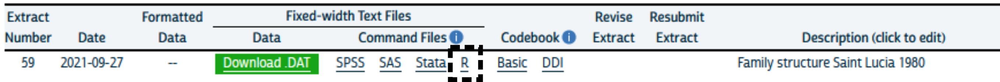

```{r setup, include=FALSE}
knitr::opts_chunk$set(
  echo = TRUE, 
  collapse = TRUE,
  comment = "#>"
)
```


<style>
.grid-logo {
  background-image: url(logos/grid.png);
  background-size: cover;
  height: 252px;
  width: 220px;
}
</style>

<style>
.derek-pet {
  background-image: url(logos/derek2.jpg);
  background-size: cover;
  height: 196;
  width: 240;
}
</style>


<style>
.isrdi-logo {
  background-image: url(logos/isrdi2.jpg);
  background-size: cover;
  height: 186px;
  width: 604px;
  position: absolute;
  bottom: 15px;
  left: 15;
}
</style>


<style>
.names {
  font-size: 1.5em;
}
</style>

<style>
  .greyed-out {
    color: #D3D3D3;
    text-indent: 20px;
  }
</style>

<style>
  .strong {
    color: #000000;
    text-indent: 20px;
  }
</style>


# Who we are

.isrdi-logo[]

.left-column[
Derek Burk, 
PhD, 
Sociology
]


.derek-pet[asdasd]


---

# Who we are

.isrdi-logo[]

.left-column[
Derek Burk, 
PhD, 
Sociology

Dan Ehrlich, 
MA, 
Anthropology
]

---

# Who we are

.isrdi-logo[]

.left-column[

Derek Burk, 
PhD, 
Sociology


Dan Ehrlich, 
MA, 
Anthropology


Kara Fisher, 
MA, 
Public Health
]


---

# Overview

1. What is IPUMS?

--

2. What is ipumsr, and why use it?

--

3. Reading data into R

--

4. Exploring and manipulating metadata

--

5. Brief analysis example

--

6. Working with IPUMS geographic data

--

7. Preview of IPUMS API functionality

--

8. Q & A

---

# Overview


.greyed-out[


.strong[`1.` What is IPUMS?]

`2.` What is ipumsr, and why use it?

`3.` Reading data into R

`4.` Exploring and manipulating metadata

`5.` Brief analysis example

`6.` Working with IPUMS geographic data

`7.` Preview of IPUMS API functionality

]


---


class: center

# What is IPUMS?

--

## IPUMS is **data**

--

## from censuses and surveys around the world,

--

## integrated across space and time,

--

## thoroughly documented,

--

## and available for free at ipums.org

???

ipums has grown substantially over the past 20?? years, and our data is organized within 9 projects

---
# 


- U.S. Census and American Community Survey **microdata** from 1850 to the present.

- 180,755,919 unique person records from decennial census and Anual community Survey.

- 191,983,898 historical personrecords from full count decennial census from 1850-1940 (1890 census lost due to fire).

- https://usa.ipums.org/usa/

???


---

# 


- Current Population Survey **microdata** from 1962 to the present.

- Monthly labor force surveys and supplements.


---

# 


- Census **microdata** covering a102 countries from 1960 to the present 


- International historic **microdata** from the 19th and early 20th centuries for *9* countries.

--

- Labor Force surveys provide high resolution **microdata** about work conditions

  - Adminstered quarterly (usually) with records going back at least 10 years (usually)
  - Currently available for Italy (2011-2020) & Spain (2005-2020)
  - Mexico (2005-2020) coming soon!


---
# 


- Demographic and Health Surveys (DHS) provide integrated **microdata** for analysis across time and space.
  - From the 1980s to the present.
  - Covering Africa and South Asia
  
- Performance Monitoring for Action (PMA) surveys
  - Focus on fertility, contraception, hygiene, and health
  - Administered frequently to monitor trends in select high-fertility countries.
  - https://ipums.github.io/pma-data-hub/index.html#category:PMA_Publications


---
# 


- Health **survey** data from the National Health Interview Survey (NHIS) from the 1960s to the present and the Medical Expenditure Panel Survey (MEPS) from 1996.

- Supplements on cost of healthcare.

???


---

# 


- Scientists and Engineers Statistical Data System (SESTAT), the leading surveys for studying the science and engineering (STEM) workforce in the United States

- Data from the National Surveys of College Graduates (NSCG), Recent College Graduates (NSRCG) and Doctorate Recipients (SDR) are integrated from 1993 to the present.


---
# 


- Historical and contemporary time use data from 1965 to the present.

- Extensive time diary data from respondents in the US and *7* other countries.

---
#


- Summary tables and time series of population, housing, agriculture, and economic data 

- GIS Shapefiles for all levels of US geography, including tracts, from 1790 to the present

---

# 


- **Summary** data tables from population and housing censuses as well as agricultural censuses from around the world

- Integrated GIS **shapefiles.**

---
# So What is Ipums?

.pull-right[

.grid[]
]

.pull-left[
- IPUMS is **a lot** of data

- United in consistently documented metadata
]

---

# So What is Ipums?

.pull-right[

.grid[]
]

.pull-left[
- IPUMS is **a lot** of data

- United in consistently documented metadata

- *What's the best way to interact with IPUMS data?*
]


???

So ipums really is **data** and a whole lot of it. These 9 different projects interact with different types of data and at different scales but they are united in 

---


class: center, middle

# Poll: Which IPUMS datasets have you used?

---


# Overview

.greyed-out[


`1.` What is IPUMS?

.strong[`2.` What is ipumsr, and why use it?]

`3.` Reading data into R

`4.` Exploring and manipulating metadata

`5.` Brief analysis example

`6.` Working with IPUMS geographic data

`7.` Preview of IPUMS API functionality

]


---


# What is ipumsr?

- R package developed by Greg Freedman Ellis

--

- Released in 2017

--

- Over 90,000 CRAN downloads

--

- Includes functions for
  - Reading IPUMS data
  - Exploring and manipulating IPUMS metadata
  - **SOON**: Interacting with the IPUMS API
    
    
???
(Metadata such as value labels, variable labels, and detailed variable 
descriptions.)

Initial API support will be for IPUMS USA, with more projects to follow soon.


---

# Why use ipumsr?

- One package for IPUMS microdata, aggregate data, and geography

???
Regarding "One package": Without ipumsr, you'd need to use a variety of
different approaches from different packages to read in and explore IPUMS
microdata (from projects such as IPUMS USA, CPS, and International), IPUMS
aggregate data (from NHGIS or IHGIS), and IPUMS shapefiles. ipumsr provides one
package with a consistent interface for working with all these different types
of IPUMS data.

---

class: center middle inverse
background-image: url(https://comicvine.gamespot.com/a/uploads/original/5/52246/1963701-the_one_ring_02.jpg)
background-size: cover

<span role="img" aria-label="Slide background shows: The 'One Ring' from The Lord of the Rings set on a fiery background."></span>

# One package to rule them all


```{r echo=FALSE, fig.alt="Slide background shows: The 'One Ring' from The Lord of the Rings set on a fiery background."}
knitr::include_graphics("transparent_blank.png")
```

---

# Why use ipumsr?

- One package for IPUMS microdata, aggregate data, and geography

- Specialized functions for viewing and manipulating IPUMS metadata

--

- Bundled how-to guides (vignettes)

--

- Potential to add more features (e.g. API support); let us know what you want!
  - File an issue at https://github.com/mnpopcenter/ipumsr/issues
  - Email ipums+cran@umn.edu

???
Regarding "More features": The aforementioned IPUMS API support will be the next
big feature. Another potential new feature is adding tools for properly handling
survey weights. Let us know what would be helpful to you via GitHub or email.

---

# Why use ipumsr?

And finally... 

--

- It's fast!
  - Time to read 3 million rows with 13 variables:

```{r, echo=FALSE}
results <- readRDS("ipumsr_speed_test.rds")
suppressPackageStartupMessages({
  # library(ggplot2)
  library(dplyr)
  suppressWarnings(library(gt))
})
# ggplot(
#   data = results,
#   aes(x = reorder(function_name, desc(time)), y = time, fill = value_labels)
# ) +
#   geom_col() + 
#   coord_flip() +
#   labs(
#     title = "How long to read 3 million rows with 13 variables?",
#     y = "Seconds",
#     x = NULL
#   ) +
#   guides(fill = guide_legend("Includes value labels?"))
results %>% 
  arrange(time) %>% 
  mutate(time = round(time, 1)) %>% 
  rename(`Function` = function_name, `Time (seconds)` = time, 
         `With metadata?` = value_labels) %>% 
  gt() %>% 
  # tab_header("How long to read 3 million rows with 13 variables?") %>% 
  cols_align("center", c(`Time (seconds)`, `With metadata?`))
```

???
There are other ways to read IPUMS data into R, but ipumsr is the fastest way 
to read the data in with attached metadata, such as variable and value labels.

---

class: center, middle

# Poll: Have you used ipumsr?

---

# Installing ipumsr
```{r, eval = FALSE}
install.packages("ipumsr")
```

--

### Or if you want the development version

```{r, eval = FALSE}
if (!require(remotes)) install.packages("remotes")
remotes::install_github("mnpopcenter/ipumsr")
```

???
Now that we've convinced you of how great ipumsr is, you're probably asking 
"How do I get my hands on it?"

---

# Installing packages used in this webinar


```{r, eval = FALSE}


# install.packages(ipumsr)

## Tidyverse
install.packages(dplyr)
install.packages(ggplot2)
install.packages(stringr)
install.packages(purrr)

## gis
install.packages(sf)
install.packages(DT)

```

---

# Downloading your data extract

```{r echo=FALSE, fig.alt="Screenshot of IPUMS data download page with the 'Download .DAT' and 'DDI' links highlighted"}
knitr::include_graphics("download_screenshot_1.png")
```

--

- Click the "Download .DAT" link to download the data

--

- Right-click the "DDI" link, and choose
    - "Save Link As..." (in Firefox)
    - "Save link as..." (in Chrome)
    - "Download Linked File" (in Safari)

???
Make sure to save the data and DDI files in the same location.

---

# Downloading your data extract

```{r echo=FALSE, fig.alt="Screenshot of IPUMS data download page with the 'R' link highlighted"}

```

- The "R" link on the downloads page contains this helper code:

```{r eval=FALSE}
# NOTE: To load data, you must download both the extract's data and the DDI
# and also set the working directory to the folder with these files (or change the path below).

if (!require("ipumsr")) stop("Reading IPUMS data into R requires the ipumsr package. It can be installed using the following command: install.packages('ipumsr')")

ddi <- read_ipums_ddi("ipumsi_00059.xml")
data <- read_ipums_micro(ddi)
```

???
This helper code checks that you have ipumsr installed, and if you do, it reads
in the DDI codebook and data into separate objects. As an aside, in case anyone
was curious, DDI stands for "Data Documentation Initiative" -- the DDI project
sets standards for documenting datasets, and the codebooks for most IPUMS
projects follow this standard.

We'll see this same code pattern in just a moment when we look at how to read 
in your data.

---

# Loading packages
```{r eval=FALSE}
library(ipumsr)
library(dplyr)
library(ggplot2)
library(stringr)
library(sf)
library(purrr)
library(DT)
```

```{r include=FALSE}
library(ipumsr)
library(dplyr)
library(ggplot2)
library(stringr)
library(sf)
library(purrr)
library(DT)
```

???
These packages are used in some of the examples we will walk through.

---


# Overview

.greyed-out[


`1.` What is IPUMS?

`2.` What is ipumsr, and why use it?

.strong[`3.` Reading data into R]

`4.` Exploring and manipulating metadata

`5.` Brief analysis example

`6.` Working with IPUMS geographic data

`7.` Preview of IPUMS API functionality

]


---

# Read in the data
- Using commands `read_ipums_ddi()` and `read_ipums_micro()`
```{r}
ddi <- read_ipums_ddi("usa_00013.xml")

data <- read_ipums_micro(ddi)
```

???
Here we see the same code pattern from the "R" helper file above, of reading the
metadata from the codebook into an object named "ddi", and using that object to 
read in the data.

---

# What's in that `ddi` object?

```{r}
names(ddi)
```

---

# What's in that `ddi` object?

```{r}
ddi$var_info
```


???
You don't need to know this to use ipumsr, but it might help you understand 
what is going on when you read in the DDI codebook and then the data.


---

# What's in my extract again?

--

Maybe I wrote an informative extract description?

```{r include=FALSE}
ddi$extract_notes <- 
  paste0(
    "User-provided description: Revision of(Revision of(Revision of(Revision ", 
    "of(my extract))))"
  )
```

```{r}
ddi$extract_notes
```

--

No such luck 😞

---

# What's in my extract again?

We can print the names of our variables:

--

```{r}
names(data)
```


But often variable names aren't self-explanatory.

--

Let's leverage that attached metadata.


---


# Overview

.greyed-out[


`1.` What is IPUMS?

`2.` What is ipumsr, and why use it?

`3.` Reading data into R

.strong[`4.` Exploring and manipulating metadata]

`5.` Brief analysis example

`6.` Working with IPUMS geographic data

`7.` Preview of IPUMS API functionality

]

---

# Available metadata
- Some (but not all) of the documentation comes with the ddi.
```{r}
ipums_var_label(ddi, PHONE)

ipums_var_desc(ddi, PHONE) %>% strwrap(60)
```

---

# Available metadata
```{r}
ipums_val_labels(ddi, PHONE)
```

---


# A nicer view of metadata

```{r, eval=FALSE}
ipums_view(ddi)
```

```{r echo=FALSE, fig.alt="Screenshot of static html page generated by function 'ipums_view', showing variable label and variable description for the variable 'PHONE'."}
knitr::include_graphics("ipums_view_screenshot.png")
```

???
The function ipums_view() makes a nicely-formatted static html page that allows 
you to browse the metadata associated with your data extract.

---


# Data
A regular `tbl_df` data.frame
```{r}
data
```

---

# Wrangling value labels

- IPUMS value labels don't translate that well to R's factors.

    - (Factors always have a label, and always have values starting at 1)
  
- So `ipumsr` imports them as `haven::labelled()` objects, which aren't
  always the easiest to deal with.

- Luckily ipumsr provides helpers that allow you to use information
  from both the value and label

```{r, include = FALSE}
label_before_after <- function(df, before_var, after_var, label_fun) {
  before_var <- rlang::enquo(before_var)
  after_var <- rlang::enquo(after_var)

  
  freqs <- df %>% 
    mutate(val = !!before_var) %>%
    group_by(val) %>%
    summarize(count = n()) 
  
  all_vals <- ipums_val_labels(df, !!before_var) %>% pull(val)
  attributes(all_vals) <- attributes(df %>% pull(!!before_var))
  
  unique_val_df <- dplyr::tibble(val = all_vals) %>%
    mutate(
      after = label_fun(val),
      `before ([val] label)` = as_factor(val, "both")
    ) %>%
    filter(after %in% levels(df %>% pull(!!after_var)) | is.na(after))
  
  attributes(unique_val_df$val) <- NULL
  attributes(freqs$val) <- NULL
  
  out <- left_join(unique_val_df, freqs, by = "val") %>%
    mutate(count = ifelse(is.na(count), 0, count)) %>%
    select(`before ([val] label)`, after, count)
  
  out %>%
    DT::datatable(
      rownames = FALSE, 
      filter = "none", 
      options = list(
        searching = FALSE, 
        scrollY = "200px",
        scrollCollapse = TRUE,
        paging = FALSE,
        bInfo = FALSE
      )
    )
}
```

---

# `as_factor()`
- `as_factor()` (from haven) converts directly to a factor.

```{r}
ipums_val_labels(data$GQ)
```

---

# `as_factor()`

- Suppose we want to keep these labels exactly as they are.

```{r}
data$GQ2 <- as_factor(data$GQ)
```

. . .

```{r, echo = FALSE}
label_before_after(data, GQ, GQ2, as_factor)
```

---

# `lbl_clean()`
- `lbl_clean()` gets rid of unused value labels.

```{r}
ipums_val_labels(data$STATEFIP)
```

---

# `lbl_clean()`
- Since our extract only has Minnesota, we don't want all of
 these values.

```{r}
data$STATEFIP2 <- data$STATEFIP %>% 
  lbl_clean() %>% 
  as_factor()
```

. . .

```{r, echo = FALSE}
label_before_after(data, STATEFIP, STATEFIP2, . %>% lbl_clean() %>% as_factor())
```

---
a
# `lbl_na_if()`
- `lbl_na_if()` allows you to set certain values or labels 
  to missing.

```{r}
ipums_val_labels(data$PHONE)
```

---

# `lbl_na_if()`

- Easier to use R's `NA` data structure to deal with missing values
  like "N/A" and "Suppressed".

```{r}
data$PHONE2 <- lbl_na_if(data$PHONE, ~.val %in% c(0, 8)) %>%
  as_factor()
```

. . . 

```{r, echo = FALSE}
label_before_after(
  data, 
  PHONE, 
  PHONE2,
  . %>% 
    lbl_na_if(~.val %in% c(0, 8)) %>%
    as_factor()
)
```

---

# `lbl_na_if()`
- It works with both values (`.val`) and labels (`.lbl`).
  So we could have also written something like this:
```{r}
drop_labels <- c("N/A", "Suppressed (2012 and 2015 ACS)")

data$PHONE3 <- lbl_na_if(data$PHONE, ~.lbl %in% drop_labels) %>%
  as_factor()
```

---

# `lbl_collapse()`
- `lbl_collapse()` allows you to take advantage of the hierarchical
  structure of value labels.
```{r}
ipums_val_labels(data$EDUCD)
```

---

# `lbl_collapse()`

- Maybe this is too much detail, so we want to collapse 
  the last digit.

```{r}
data$EDUCD2 <- lbl_collapse(data$EDUCD, ~.val %/% 10) %>%
  as_factor()
```

. . .

```{r, echo = FALSE}
label_before_after(
  data, 
  EDUCD, 
  EDUCD2,
  . %>% lbl_collapse(~.val %/% 10) %>%
    as_factor()
)
```

---

# `lbl_relabel()`
- `lbl_relabel()` has more granular control of what the values are assigned to.

```{r}
levels(data$EDUCD2)
```

---

# `lbl_relabel()`

- Maybe the education variable is still too specific.

```{r}
data$EDUCD3 <- data$EDUCD %>%
  lbl_collapse(~.val %/% 10) %>% 
  lbl_relabel(
    lbl(2, "Less than High School") ~.val > 0 & .val < 6,
    lbl(3, "High school") ~.lbl == "Grade 12",
    lbl(4, "Some college") ~str_detect(.lbl, "^[123] year(s)? of college$"),
    lbl(5, "College or more") ~.val %in% c(10, 11)
  ) %>%
  as_factor()
```

---

# `lbl_relabel()`

```{r, echo = FALSE}
label_before_after(
  data, 
  EDUCD, 
  EDUCD3,
  . %>%
    lbl_collapse(~.val %/% 10) %>% 
    lbl_relabel(
      lbl(2, "Less than High School") ~.val > 0 & .val < 6,
      lbl(3, "High school") ~.lbl == "Grade 12",
      lbl(4, "Some college") ~str_detect(.lbl, "^[123] year(s)? of college$"),
      lbl(5, "College or more") ~.val %in% c(10, 11)
    ) %>%
    as_factor()
)
```


---


# Overview

.greyed-out[


`1.` What is IPUMS?

`2.` What is ipumsr, and why use it?

`3.` Reading data into R

`4.` Exploring and manipulating metadata

.strong[`5.` Brief analysis example]

`6.` Working with IPUMS geographic data

`7.` Preview of IPUMS API functionality

]


---

# Phone availability 
- Now that they're factors, ready for use as regular R data
```{r graph1, eval=FALSE}
graph_data <- data %>%
  group_by(YEAR) %>%
  summarize(`% with phone` = weighted.mean(
    PHONE2 == "Yes, phone available", PERWT, na.rm = TRUE
  ))

ggplot(graph_data, aes(x = YEAR, y = `% with phone`)) +
  geom_point() +
  geom_line() + 
  labs(
    title = "Percent of Minnesota with phone line",
    subtitle = paste0("Data source: ", ddi$ipums_project),
    caption = paste(strwrap(ipums_var_desc(ddi, PHONE), 90), collapse = "\n")
  )
```

---

# Phone availability
```{r graph1, dpi=300, fig.height=4, fig.width=6, echo = FALSE}
```

---

# Interpretation

> The 2008 ACS and 2008 PRCS instructed respondents to include cell 
> phone service; prior to 2008, this was not made explicit.
> 
> - https://usa.ipums.org/usa-action/variables/PHONE#comparability_section

---

# Phone availability by education
```{r graph2, dpi=300, fig.height=4, fig.width=6, echo = FALSE}
graph_data <- data %>%
  group_by(YEAR, EDUCD3) %>%
  summarize(`% with phone` = weighted.mean(
    PHONE2 == "Yes, phone available", PERWT, na.rm = TRUE
  ), .groups = "drop")

ggplot(graph_data, aes(x = YEAR, y = `% with phone`)) +
  geom_point() +
  geom_line() + 
  facet_wrap(~EDUCD3) + 
  labs(
    title = "Percent of Minnesota with phone line by education",
    subtitle = paste0("Data source: ", ddi$ipums_project)
  )
```

---

# Overview

.greyed-out[


`1.` What is IPUMS?

`2.` What is ipumsr, and why use it?

`3.` Reading data into R

`4.` Exploring and manipulating metadata

`5.` Brief analysis example

.strong[`6.` Working with IPUMS geographic data]

`7.` Preview of IPUMS API functionality

]


---

# Getting geographic data

- For IPUMS USA (and several other projects), we provide geographic boundaries 
  as well. For many areas, this includes harmonizing boundary changes over time.

- Our extract includes the variable CONSPUMA, for "Consistent Public Use 
  Microdata Areas"

- Note: CONSPUMA units are large
  - For finer geographic detail, check out IPUMS NHGIS

???
Geographic boundary data is usually found via a "Geography and GIS" link on the
left sidebar of the home page for a data collection, under the heading
"Supplemental Data".

---

# Loading shape data

- `ipumsr` provides support for both sf and sp data; we'll use sf here

- Load with the `ipums_read_sf()` function (mostly just a wrapper around
  `sf::read_sf()`)


```{r}
shape_data <- read_ipums_sf("shape/")
```

???
The sp package (short for "spatial") has been around since 2005. It is more
established and some other R spatial packages might still assume you are using
sp data structures. The sf package (short for "simple features") is newer, but 
seems to be on the rise as an alternative sp for some use cases.

---

# Loading shape data

```{r}
as_tibble(shape_data)
```
???
At the risk of oversimplifying, an sf object is basically a tibble or data.frame
with a special geometry column. That simplification helps me understand the 
process of joining the sf object to data.

---

# Joining shape data
- `ipumsr` has helpers for merging data that work with both sf and sp structures 

```{r}
conspuma_data <- data %>%
  group_by(CONSPUMA, YEAR) %>%
  summarize(
    PHONE = weighted.mean(
      PHONE2 == "Yes, phone available", PERWT, na.rm = TRUE
    ),
    .groups = "drop"
  )

conspuma_data <- ipums_shape_inner_join(
  conspuma_data, 
  shape_data, 
  by = "CONSPUMA"
)
```

???
Before joining to shape data, we need to summarize our person level data at the 
level of the geography we are joining to. Thus, the first block of code computes 
the weighted proportion of persons with access to a phone for each CONSPUMA 
unit in each year. Once our data are summarized so that each row represents a 
value for one CONSPUMA unit in one year, we can join to the sf object we loaded 
above.

---

# Plotting shape data
- Since the addition of `geom_sf()`, ggplot2 can plot sf data:
```{r graph3, dpi=300, fig.height=4, fig.width=6, echo = FALSE}
graph_data <- conspuma_data %>% 
  filter(YEAR %in% c(1980, 1990, 2000, 2010))

ggplot(graph_data, aes(fill = PHONE)) +
  facet_wrap(~YEAR) + 
  geom_sf()
```

???
For more information on IPUMS geographic data, see the ipumsr vignette on
working with geographic data, or one of several collection-specific recorded
webinars on that topic.

---
# Overview

.greyed-out[


`1.` What is IPUMS?

`2.` What is ipumsr, and why use it?

`3.` Reading data into R

`4.` Exploring and manipulating metadata

`5.` Brief analysis example

`6.` Working with IPUMS geographic data

.strong[`7.` Preview of IPUMS API functionality]

]


---

# API Timeline

- Currently in internal testing

- Beta testing before the end of 2021

- IPUMS USA public launch early 2022

???
The API is not yet publicly available, but we wanted to offer a preview of the 
functionality that will soon be available in ipumsr.

We plan to support creating extracts via API for all of our data collections, 
but that support will be rolled out one collection at a time, to allow us to 
thoroughly test that the extract API is working as expected for each collection.

IPUMS USA is the first collection that will be supported, and we are currently
doing internal testing of the API for USA. We'll put out a call for beta testers
before the end of this year, but feel free to reach out in the meantime if you
want to be added to that list. We expect to open up the USA extract API to all
IPUMS USA users in the first few months of next year, depending on what sort of
issues arise during beta testing.

Another important note is that there is already a public API for the IPUMS NHGIS
collection, which offers access to tabular data from the US Census Bureau, as
well as corresponding geographic boundaries. ipumsr does not yet include
functions for interacting with the NHGIS API, but there is a guide to
interacting with that API in R, which we'll share a link to at the end of these
slides, and we plan to add that functionality to ipumsr sometime next year.

---

# What can I do with the API?

- Define and submit extract requests

--

- Check extract status or "wait" for an extract to finish

--

- Download completed extracts

--

- Get info on past extracts

--

- Share extract definitions

???
So, your next question might be, "what will I be able to do with this API?" 
Here's the high-level overview:

You'll be able to:

Define and submit extract requests.

Check the status of a submitted extract, or have R "wait" for an extract to 
finish by periodically checking the status until it is ready to download.

Download completed data extracts.

Get information on past extracts, including the ability to pull down the 
definition of a previous extract, revise that definition, and resubmit it.

And finally, you can save your extract definition to a JSON file, allowing you 
to share the extract definition with other users for collaboration or 
reproducibility. Saving as JSON makes the definition more easily shareable 
across languages, since R is not the only way to interact with the IPUMS API -- 
you can also call the API using a general purpose tool like curl, and IPUMS is 
developing API client tools for Python in parallel with the R client tools that 
will be part of the ipumsr package.

---

# What can't I do with the API?

- Bypass the extract system entirely

--

- Explore what data are available

--

- Use all features of the extract system (at least not right away)


???
The other important question to answer is what the API can't do.

Most importantly, it can't deliver data "on demand" -- extracts are still 
created through the same extract system used by the website, which means you 
have to wait for your extract to process before you can download it.

In other words, the API does not create a separate system of accessing IPUMS
data, but rather provides a programmatic way to create and download extracts
through the existing extract system.

Secondly, you can't use the API to explore what data are available from IPUMS. 
We plan to add a public metadata API, but the timeline on that is more unknown.

A third limitation is that API users will not initially have access to all the
bells and whistles of the extract system, such as the ability to attach 
characteristics of family members such as spouses or children. We plan to add 
these capabilities once the core functionality is well-tested and stable.

---

# Pipe-friendly example

```{r eval=FALSE}
my_extract <- define_extract(
  "usa", 
  "Occupation by sex and age",
  c("us2017a", "us2018a"), 
  c("SEX", "AGE", "IND", "OCC")
)
```

--

Extract definition to data in one piped expression!

```{r eval=FALSE}
data <- my_extract %>% 
  submit_extract() %>% 
  wait_for_extract() %>% 
  download_extract() %>% 
  read_ipums_micro()
```

???
Now let's get to some example code! We'll start with a brief example that shows 
a typical API workflow using the "pipe" operator from the magrittr package, 
which is often used in conjunction with tidyverse packages such as dplyr.

We start by defining an extract object using the `define_extract()` function, 
and specifying 

- a data collection -- in this case, "usa" 
- an extract description -- "Occupation by sex and age"
- samples -- here we're asking for the 2017 and 2018 American Community Survey 
- and variables -- sex, age, industry and occupation.

The next code chunk shows how we can go from this extract definition to having 
our extract data available in our R session in one piped expression. For any of 
you who are unfamiliar with the pipe operator, it can be read aloud as the word 
"then". So this piped expression says, take "my_extract", *then* submit extract, 
*then* wait for extract, *then* download extract, *then* read in the data using 
`read_ipums_micro()`.

Since we have to wait for the extract to process, this piped expression will 
take a bit of time to execute, depending on the size of your extract, but if we 
have time we will actually run some code like this during the Q&A so you can 
see it in action.

---

# Pipe-friendly example

```{r eval=FALSE}
my_extract <- define_extract(
  "usa", 
  "Occupation by sex and age",
  c("us2017a", "us2018a"), 
  c("SEX", "AGE", "IND", "OCC")
)
```

Extract definition to data in one piped expression!

```{r eval=FALSE}
data <- my_extract |> 
  submit_extract() |> 
  wait_for_extract() |> 
  download_extract() |> 
  read_ipums_micro()
```


???
And just for fun, here's what the same piped expression looks like with the new
base R pipe, available as of R 4.1.

---

# Revise and resubmit

Get definition of my most recent extract:

```{r eval=FALSE}
old_extract <- get_recent_extracts_info_list("usa", 1)[[1]]
```

--

Or if we know the number of the extract:

```{r eval=FALSE}
old_extract <- get_extract_info("usa:33")
```


???
Another handy workflow where using the extract API is a "revise and resubmit" 
workflow. Often, you might realize that you should have added one more or a few 
more variables to your previous extract, and you just want to resubmit that 
extract with a few additional variables.

To do this with ipumsr functions, you first pull down the definition of your 
most recent extract using the function `get_recent_extracts_info_list()`, which 
can return information on up to 10 recent extracts. Here, we specify that we 
only want one recent extract (the most recent one), but because this function 
always returns a list, we also have to subset the first element.

Alternatively, if we know the extract number of the extract we want to revise, 
we can use `get_extract_info()` and specify a shorthand notation for USA 
extract number 33, for example.

---

# Revise and resubmit

Then add a variable and resubmit:

```{r eval=FALSE}
old_extract %>% 
  revise_extract(vars_to_add = "EDUC") %>% 
  submit_extract()
```

???
Once we have the old extract definition, we can pass it to the 
`revise_extract()` function to add a variable, then resubmit it.

The `revise_extract()` function currently allows you to add and remove variables
and samples, as well as change the description, data format, or data structure
of your extract definition.

---

# Share your extract definition

```{r eval=FALSE}
save_extract_as_json(my_extract, "my_extract.json")
```

--

Another user can read that definition back in with:

```{r eval=FALSE}
cloned_extract <- define_extract_from_json("my_extract.json", "usa")
```

???
One thing that really excites us about the API is the ability to share extract
definitions to facilitate collaboration or reproducibility.

To write your extract out to a JSON file, you can use the 
`save_extract_as_json()` function as shown here.

Saving as JSON makes it easier to share an extract definition with another user 
who might not use R -- they can use the JSON definition to submit the extract 
using curl or Python, possibly using the currently in-development IPUMS API 
client tools in the "ipumspy" module.

If you are using ipumsr, the `define_extract_from_json()` function will create
an extract object from a JSON-formatted definition shared by someone else.

---

# Resources
- Email us: ipums+cran@umn.edu

- ipumsr github: https://github.com/mnpopcenter/ipumsr

- This presentation: https://github.com/dtburk/ipumsr-webinar

- ipumsr website, with vignettes: http://tech.popdata.org/ipumsr/index.html

- IPUMS tutorials page: https://www.ipums.org/support/tutorials

- *Geocomputation with R* book: https://geocompr.robinlovelace.net/