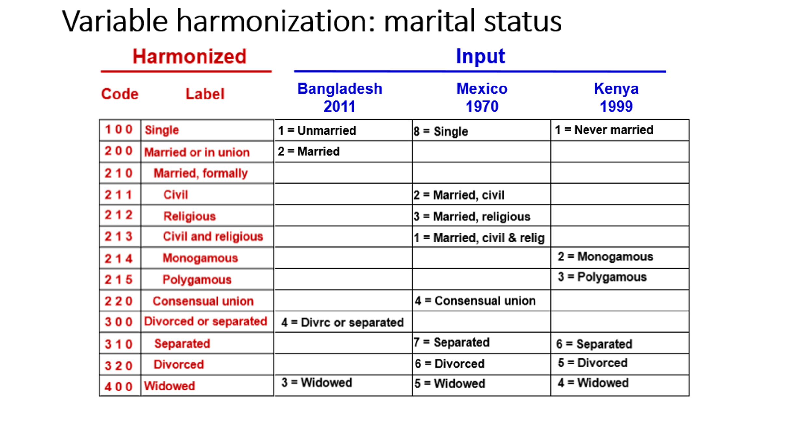
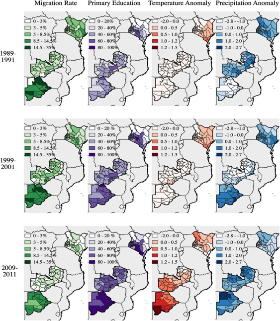
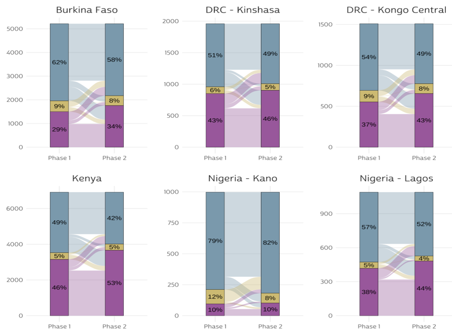
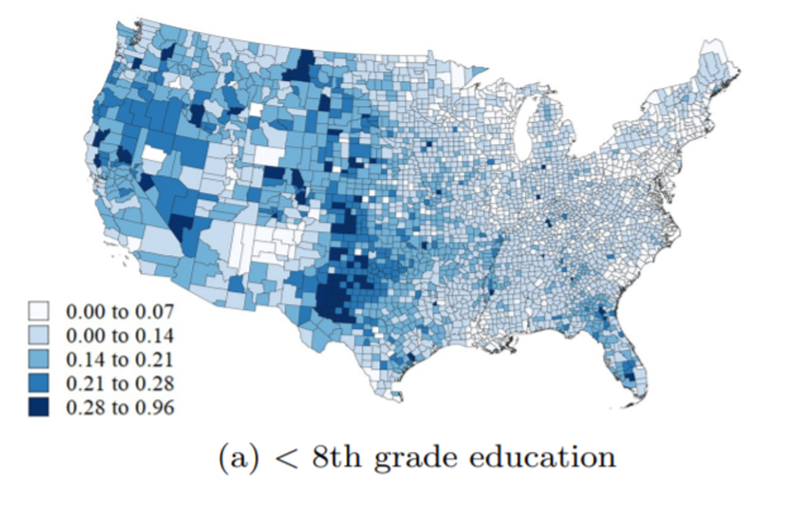
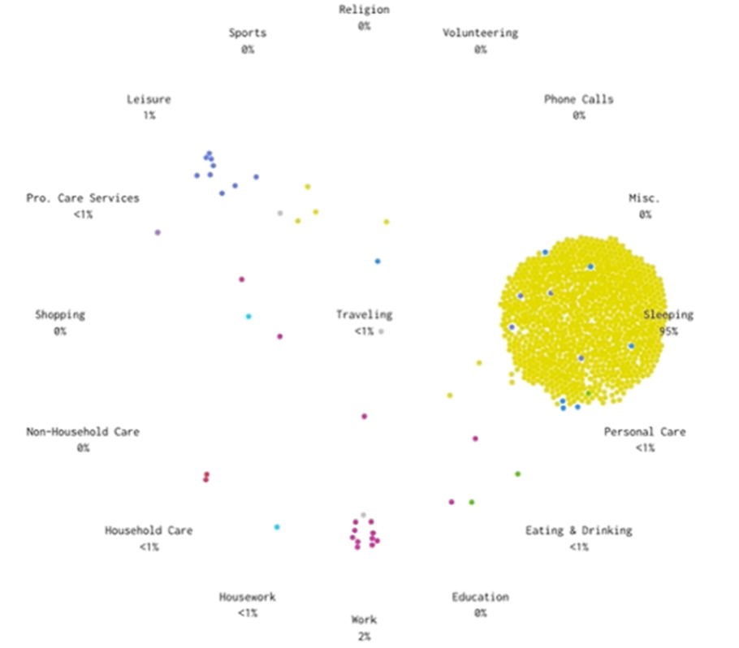
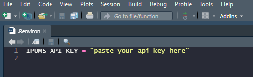
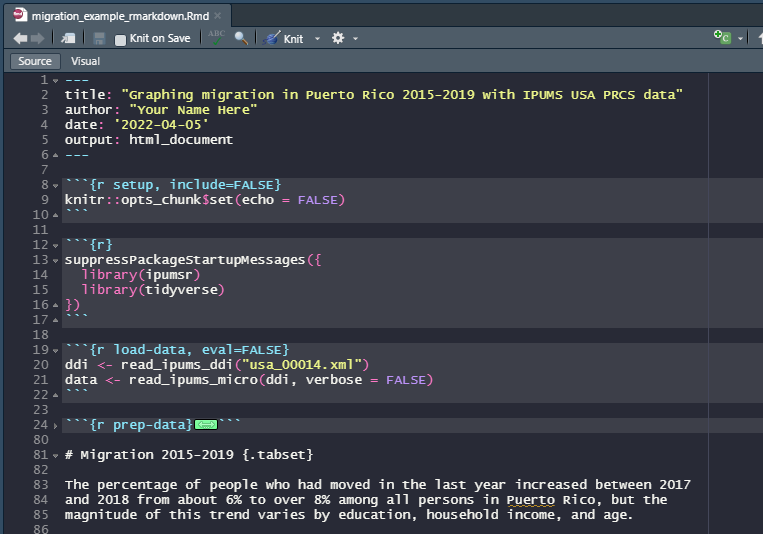
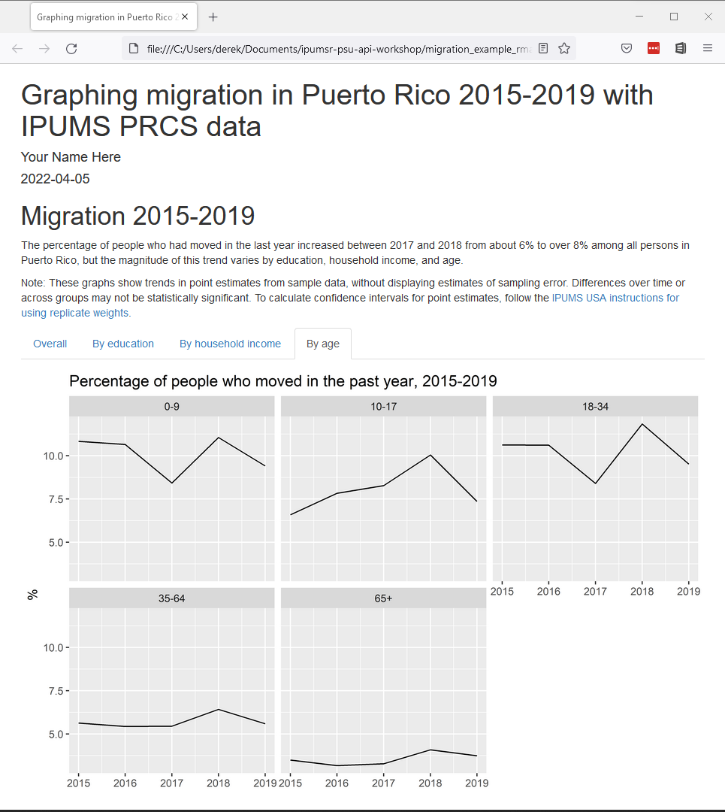
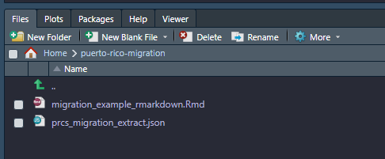
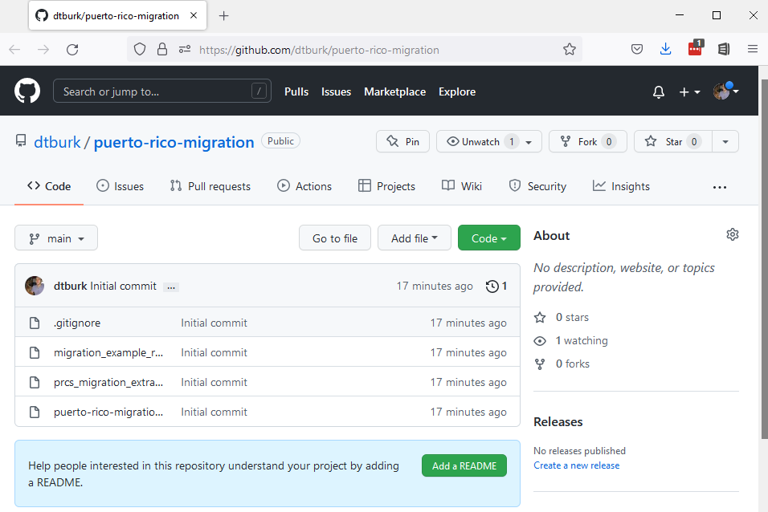

```{r setup, include=FALSE}
knitr::opts_chunk$set(
  echo = TRUE, 
  collapse = TRUE,
  comment = "#>"
)

hook_source <- knitr::knit_hooks$get('source')
knitr::knit_hooks$set(source = function(x, options) {
  x <- gsub(
    "^[[:blank:]]?([^*].+?)[[:blank:]]*#<<[[:blank:]]*$", 
    "*\\1", 
    x,
    perl = TRUE
  )
  hook_source(x, options)
})

options(width = 50)
```

<style>
.derek-pet {
  background-color: #000000;
  background-image: url(images/derek2.jpg);
  background-size: cover;
  width: 120px;
  height: 160px;
  position: absolute;
  left: 125px;
  top: 150px;
}
</style>


<style>
.dan-pet1 {
  background-color: #d3d3d3;
  background-image: url(images/felix.jpg);
  background-size: cover;
  width: 120px;
  height: 160px;
  position: absolute;
  left: 305px;
  top: 225px;
  
}
</style>


<style>
.dan-pet2 {
  background-color: #000000;
  background-image: url(images/luna.jpg);
  background-size: cover;
  width: 120px;
  height: 120px;  
  position: absolute;
  left: 450px;
  top: 250px;
}
</style>


<style>
.kara-pet1 {
  background-color: #000000;
  background-image: url(images/Ru.jpg);
  background-size: cover;
  width: 120px;
  height: 160px;
  position: absolute;
  left: 600px;
  bottom: 200px;
}
</style>

<style>
.kara-pet2 {
  background-color: #000000;
  background-image: url(images/harvey.jpg);
  background-size: cover;
  width: 120px;
  height: 160px;
  position: absolute;
  left: 730px;
  bottom: 200px;
}
</style>


<style>
.grid-logo {
  background-image: url(images/grid.png);
  background-size: cover;
  width: 400px;
  height: 400px;
  position: absolute;
  right: 75px;

}
</style>


<style>
.isrdi-logo {
  background-image: url(images/isrdi2.jpg);
  background-size: cover;
  height: 186px;
  width: 604px;
  position: absolute;
  bottom: 15px;
  left: 15;
}
</style>


<style>
.names {
  font-size: 1.5em;
}
</style>

<style>
  .greyed-out {
    color: #D3D3D3;
    text-indent: 20px;
  }
</style>

<style>
  .strong {
    color: #000000;
    text-indent: 20px;
  }
</style>

# Who we are


.isrdi-logo[

]

--

.left[
Derek Burk, PhD 

Sociology
]

--

.center[
Dan Ehrlich, MA

Anthropology


]

--

.right[


Kara Fisher,
MPH

Public Health

]


???
(Name, pronouns, academic field, time with IPUMS)

So, my name is Derek Burk, I use he/him pronouns, I've been working on the
IPUMS International team for the past four years, and my academic training is in
sociology.


---

# Who we are

.isrdi-logo[]


.derek-pet[

]

.dan-pet1[]

.dan-pet2[]

.kara-pet1[]
.kara-pet2[]


???

Rather than our faces, we thought everyone would appreciate pets.

**A FEW NOTES**

This presentation will be recorded and will be available along with slides so don't worry about trying to take notes.

You can always reach out to through our **github**, or via **user support**.

---

# Overview

1. What is IPUMS?

--

2. What is ipumsr, and why use it?

--

3. How to create a data extract

--

4. Reading data into R

--

5. Exploring and manipulating metadata

--

6. Brief analysis example

--

7. Intro to the IPUMS USA API

--

8. Preview of IPUMS API functionality

--

9. Q & A

---


# Overview


.greyed-out[


.strong[`1.` What is IPUMS?]

`2.` What is ipumsr, and why use it?

`3.` How to create a data extract

`4.` Reading data into R

`5.` Exploring and manipulating metadata

`6.` Brief analysis example

`7.` Intro to the IPUMS USA API

`8.` Preview of IPUMS API functionality

`9.` Q & A


]


---


class: center

# What is IPUMS?

--

## IPUMS is **data**


## from censuses and surveys around the world,


## **harmonized** across space and time,


## thoroughly documented,


## and available for free at ipums.org


???


ipums has grown substantially since its first beta release in 1993, 

started with **US census data** has grown to include 9 collections


---

# Harmonization


```{r echo=FALSE, fig.alt="Table illustrating IPUMS harmonization process.", fig.height=3, fig.width=5}

```


---
# 


- U.S. Census and American Community Survey **microdata** from 1850 to the present.

- 180,755,919 unique person records from decennial census and American Community Survey.

- 191,983,898 historical person records from full count decennial census from 1850-1940 (1890 census lost due to fire).

- https://usa.ipums.org/usa/

???


---
# 


- Current Population Survey **microdata** from 1962 to the present.

- Monthly labor force surveys and supplements.

- https://cps.ipums.org/cps/


---
# 


- Health **survey** data from the National Health Interview Survey (NHIS) from the 1960s to the present and the Medical Expenditure Panel Survey (MEPS) from 1996.

- Supplements on cost of healthcare.

- https://healthsurveys.ipums.org/
???


---
# 


- Scientists and Engineers Statistical Data System (SESTAT), the leading surveys for studying the science and engineering (STEM) workforce in the United States

- Data from the National Surveys of College Graduates (NSCG), Recent College Graduates (NSRCG) and Doctorate Recipients (SDR) are integrated from 1993 to the present.

- https://highered.ipums.org/highered/


---
# 


- Census **microdata** covering 103 countries from 1960 to the present 


- International historic **microdata** from the 19th and early 20th centuries available for some samples.


- Labor Force surveys provide high resolution **microdata** about work conditions

  - Administered quarterly (usually) with records going back at least 10 years (usually)
  - Currently available for Italy (2011-2020), Spain (2005-2020), and Mexico (2005-2020)

- https://international.ipums.org/international/


---
# 


.pull-left[

- “Climate-Induced migration and unemployment in middle-income Africa”

- Valerie Mueller, Clark Gray, and Douglas Hopping
]

.pull-right[

]


---
# 


- Demographic and Health Surveys (DHS) provide integrated **microdata** for analysis across time and space.
  - From the 1980s to the present.
  - Covering Africa and South Asia
  
- Performance Monitoring for Action (PMA) surveys
  - Focus on fertility, contraception, hygiene, and health
  - Administered frequently to monitor trends in select high-fertility countries.
  
  - https://globalhealth.ipums.org/

---


# 


.pull-left[

]

.pull-right[
  - https://tech.popdata.org/pma-data-hub/
]

???

Check out blog using IPUMS Global Health Data


---


.pull-left[ 


]


.pull-right[


]


.pull-left[ 

- **NHGIS** Shapefiles for all levels of US geography including tracts, from 1790 to the present


- https://www.nhgis.org/
]


.pull-right[


- **IGIS** Shapefiles for admin level 2

- https://ihgis.ipums.org/


]

- Summary tables and time series of population, housing, agriculture, and economic data 


---

#


- “Migrant Selection and Sorting during the Great American Drought.” 
- Christopher Sichko


.pull-left[


]

.pull-right[





]


---


# 


- Historical and contemporary time use data from 1965 to the present.

- Extensive time diary data from respondents in the US and *7* other countries.

- https://timeuse.ipums.org/


---

# 

.pull-left[
- Nathan Yau of Flowing Data

- http://flowingdata.com/projects/2015/timeuse-simulation/
]

.pull-right[


]


---

# So what is IPUMS?


.grid-logo[

]

.pull-left[

- IPUMS is **a lot** of data

- Individual-level microdata

- Summarized tabular data

- GIS shapefiles

- Consistent and extensively documented **metadata**


]


???

So ipums really is **data** and a whole lot of it. These 9 different projects interact with different types of data and at different scales but they are united in the use of metadata that helps contextualize the data

*So I know you're asking yourselves..*
---

# So what is IPUMS?


.grid-logo[

]


.pull-left[
- IPUMS is **a lot** of data

- Individual-level microdata

- Summarized tabular data

- GIS shapefiles

- Consistent and extensively documented **metadata**

- *How can I work with all this IPUMS data?*
]


???


---


# Overview

greyed-out[

`1.` What is IPUMS?

.strong[`2.` What is ipumsr, and why use it?]

`3.` How to create a data extract

`4.` Reading data into R

`5.` Exploring and manipulating metadata

`6.` Brief analysis example

`7.` Intro to the IPUMS USA API

`8.` Preview of IPUMS API functionality

`9.` Q & A


]


---


# What is ipumsr?

<style>
.ipumsr-logo {
  background-image: url(images/ipumsr.png);
  background-size: cover;
  height: 298px;
  width: 257px;
  position: absolute;
  right: 50px;
  bottom: 50px;
}
</style>


.ipumsr-logo[

]

- R package developed by Greg Freedman Ellis


- Released in 2017


- Over 100,000 CRAN downloads


- Includes functions for
  - Reading IPUMS data
  - Exploring and manipulating IPUMS metadata
  - **SOON**: Interacting with the IPUMS API
    
    
???
(Metadata such as value labels, variable labels, and detailed variable 
descriptions.)

Initial API support will be for IPUMS USA, with more projects to follow soon.


---

# Why use ipumsr?

- One package for IPUMS microdata, aggregate data, and geography


- Specialized functions for viewing and manipulating IPUMS metadata


- Bundled how-to guides (vignettes)


- Potential to add more features (e.g. API support); let us know what you want!
  - File an issue at https://github.com/mnpopcenter/ipumsr/issues
  - Email ipums+cran@umn.edu

???

Regarding "One package": Without ipumsr, you'd need to use a variety of
different approaches from different packages to read in and explore IPUMS


**microdata** from IPUMS: USA, CPS, and International, IPUMS

**aggregate data** (from NHGIS or IHGIS), 
and **IPUMS shapefiles**. ipumsr provides one
package with a consistent interface for working with all these different types
of IPUMS data.

*a one stop shop that makes it easy to work with ipums data*

Regarding "More features": The aforementioned IPUMS API support will be the next
big feature. Another potential new feature is adding tools for properly handling
survey weights. Let us know what would be helpful to you via GitHub or email.

---

---
class: center, middle

# To run the code in this presentation

???

Repeat: slides/recording will be available. To run this code yourself you can clone/download the repo from our github. This provides the data extracts you'll need. 

However, you may need to install some additional packages used in the example code below, as shown on the next slide.

---

.pull-left[
# Install R packages (as needed)

```{r, eval = FALSE}
install.packages("ipumsr")

## Tidyverse
install.packages("dplyr")
install.packages("ggplot2")
install.packages("stringr")
install.packages("purrr")

## HTML tables
install.packages("DT")

## gis
install.packages("sf")
```

]


.pull-right[
# Load R packages (each time)
```{r, eval = FALSE}
library(ipumsr)

## Tidyverse
library(dplyr)
library(ggplot2)
library(stringr)
library(purrr)

## HTML tables
library(DT)

## gis
library(sf)
```

]

```{r, echo = FALSE, include=FALSE}
library(ipumsr)

## Tidyverse
library(dplyr)
library(ggplot2)
library(stringr)
library(purrr)

## HTML tables
library(DT)

## gis
library(sf)
```


???

reminder, installing packages only needs to happen once, but some packages do update frequently so it can be a good idea to re-install once in a while


---


# Overview

.greyed-out[


`1.` What is IPUMS?

`2.` What is ipumsr, and why use it?

.strong[`3.` How to create a data extract]

`4.` Reading data into R

`5.` Exploring and manipulating metadata

`6.` Brief analysis example

`7.` Intro to the IPUMS USA API

`8.` Preview of IPUMS API functionality

`9.` Q & A

]

???

Dan passes to Derek. Derek switches to a web demo of extract system.

---


# Overview

.greyed-out[


`1.` What is IPUMS?

`2.` What is ipumsr, and why use it?

`3.` How to create a data extract

.strong[`4.` Reading data into R]

`5.` Exploring and manipulating metadata

`6.` Brief analysis example

`7.` Intro to the IPUMS USA API

`8.` Preview of IPUMS API functionality

`9.` Q & A


]


???

Website demo ends, back to slides. Derek passes to Kara.

---

# Downloading your data extract

```{r echo=FALSE, fig.alt="Screenshot of IPUMS data download page with overlaid instructions: 1. Click the 'Download .DAT' link to download the data. 2. Right click the 'DDI' link. 3. In the right-click menu, choose 'Save link as' in Firefox or Chrome, or 'Download Linked File' in Safari."}
knitr::include_graphics("images/microdata_annotated_screenshot.png")
```

--

- You must download both the data and DDI codebook

- Save both files in the same folder

???

Kind of confusing how to save the DDI/.xml file. THIS IS HOW.
DDI is EXTREMELY important, as it contains all the instructions regarding the METADATA

Once your extract is complete, download the data file and the DDI. Downloading
the DDI is a little bit different depending on your browser. On most browsers
you should right-click the file and select “Save As…”. If this saves a file with
a .xml file extension, then you should be ready. However, Safari users must
select “Download Linked File” instead of “Download Linked File As”. On Safari,
selecting the wrong version of these two will download a file with a .html file
extension instead of a .xml extension.

In case anyone was curious, DDI stands for "Data Documentation Initiative" --
the DDI project sets standards for documenting datasets, and the codebooks for
most IPUMS projects follow this standard.

Make sure to save the data and DDI files in the same location.

---

# Downloading your data extract

- Optional: "R" link contains code to read in your data with ipumsr

```{r echo=FALSE, fig.alt="Screenshot of IPUMS data download page with the 'R' link highlighted"}
knitr::include_graphics("images/download_screenshot_2.png")
```


???
The links under "Command Files" contain program-specific code for reading in the
data. The R one contains the code we'll show on the next slide.

This helper code checks that you have ipumsr installed, and if you do, it reads
in the DDI codebook and data into separate objects. 

---

# Read in the data

```{r include=FALSE}
if (!dir.exists("presentation_extract")) dir.create("presentation_extract")
presentation_extract_files <- list.files(
  "presentation_extract", 
  full.names = TRUE
)
ddi_path <- str_subset(presentation_extract_files, pattern = "\\.xml$")
data_path <- str_subset(presentation_extract_files, pattern = "\\.dat\\.gz$")

# There should only be one ddi file and one data file, so if there are zero or 
# more than one, we want to delete everything in that directory and re-submit 
# the extract
if (length(ddi_path) != 1 || length(data_path) != 1) {
  file.remove(presentation_extract_files)
  ddi_path <- define_extract_micro(
    "usa",
    "Extract for PSU API workshop",
    c("us2015b", "us2016b", "us2017b", "us2018b", "us2019b"),
    c(
      "YEAR", "SAMPLE", "SERIAL", "CBSERIAL", "HHWT", "CPI99", "GQ", 
      "COSTELEC", "HHINCOME", "VACANCY", "CINETHH", "PERNUM", "PERWT", 
      "MOMLOC", "POPLOC", "RELATE", "RELATED", "SEX", "AGE", "MARRINYR", 
      "DIVINYR", "WIDINYR", "FERTYR", "RACE", "RACED", "HISPAN", "HISPAND", 
      "SPEAKENG", "EDUC", "EDUCD", "EMPSTAT", "EMPSTATD", "INCTOT", 
      "MIGRATE1", "MIGRATE1D"
    )
  ) %>% 
    submit_extract() %>% 
    wait_for_extract() %>% 
    download_extract(download_dir = "presentation_extract")
}

ddi <- read_ipums_ddi(ddi_path)
data <- read_ipums_micro(ddi)
```


- Using functions `read_ipums_ddi()` and `read_ipums_micro()`
```{r eval=FALSE}
ddi <- read_ipums_ddi("usa_00013.xml")

data <- read_ipums_micro(ddi)
```

--

- This also works:

```{r eval=FALSE}
data <- read_ipums_micro("usa_00013.xml")
```

- Note: supply the codebook, *not* the data file, to `read_ipums_micro()`

???
So you've downloaded both the data and the DDI codebook, and saved them in the 
same folder. Here's how you actually read the data into R.

The first option, and the one I'd recommend, is to read the DDI codebook into an 
object named "ddi" using the `read_ipums_ddi()` function, and then supply that 
ddi object to `read_ipums_micro()`.

The second option is to read in the data by passing the file path to the DDI
codebook to the `read_ipums_micro()` function. However, we recommend the first
pattern because it's often helpful to save the codebook to it's own object to
preserve the original metadata once you start messing around with the data.

Notice that in both cases we are supplying the codebook (either already read in
or as a file path), not the data file, to `read_ipums_micro()`. The fact that we
don't point to the actual data file when reading in the data might confusing. If
I want to read in the data shouldn't I point to the data file?

---

class: center middle

# Why do I point to the codebook to read in the data?

--

### The data file is the **raw ingredients**, the codebook is the **recipe**

???
Here's my attempt to explain this in a hopefully memorable way: the data file 
is the raw ingredients, and the codebook is the recipe. And when you go to make 
dinner, your recipe tells you how to combine your ingredients to get the 
finished product.

Note for future revisions of this section: Seems like we could add a visual or 
two here (possibly from Allison Horst's collection of R illustrations), and/or 
improve the analogy (would Lego set and instruction booklet be better?).

---

# The data file is just raw ingredients

```{r echo=FALSE, comment = ''}
readLines("usa_00013.dat.gz", n = 10) %>% 
  paste0(collapse = "\n") %>% 
  cat()
```
???
Looking at the first ten lines of our example data file, it makes sense why you 
can't just tell R "read this data file into a data.frame". The data file itself
doesn't contain any information about what the variables are called or which 
numbers on each line correspond to which variables, let alone what the meaning 
of those values might be.

(In case you're wondering what those blanks are, that's a geography variable 
that is not available in some years of our data.)

---

# The DDI codebook is the recipe

```{r, results='markup'}
names(ddi)
```
--

```{r}
ddi$file_name
```

???
The DDI codebook tells you what to do with the ingredients in the data file. It
contains a bunch of information about your extract, including the name of the
data file, which is why you don't need to supply the path to the data file if
you saved the codebook and data in the same folder.

But perhaps the most important element for understanding and analyzing the data
is the "var_info" element, so let's take a look at that.

---

# The DDI codebook is the recipe

```{r echo=FALSE}
old_width <- getOption("width")
options(width = 150)
```


```{r}
ddi$var_info
```

```{r echo=FALSE}
options(width = old_width)
```

???
As we can see here, var_info is just data.frame where each row has information 
about one variable, including the variable name, label, description, and value 
labels, as well as where the variable is located in the fixed-width file.

You don't need to remember the details of what's in the DDI object or this 
var_info data.frame, as long as you remember that to read in the data, you must 
point to the DDI codebook, not the data file.

---

# Overview

.greyed-out[


`1.` What is IPUMS?

`2.` What is ipumsr, and why use it?

`3.` How to create a data extract

`4.` Reading data into R

.strong[`5.` Exploring and manipulating metadata]

`6.` Brief analysis example

`7.` Intro to the IPUMS USA API

`8.` Preview of IPUMS API functionality

`9.` Q & A

]

---

# What's in my extract again?

--

Maybe I wrote an informative extract description?

```{r include=FALSE}
ddi$extract_notes <- 
  paste0(
    "User-provided description: Revision of(Revision of(Revision of(Revision ", 
    "of(my extract))))"
  )
```

```{r}
ddi$extract_notes %>% strwrap(60)
```

--

No such luck 😞

???
So we've read in our data -- how do we go about exploring it?

We could refer back to the description we wrote when creating the extract, 
maybe that will be informative. Let's see (read extract description). Ooh, 
that's not very helpful. I'm guessing this joke hits close to home for some of 
you long-time IPUMS users.

---

# What's in my extract again?

We can print the names of our variables:

--

```{r}
names(data)
```


But often variable names aren't self-explanatory.

--

Let's leverage that attached metadata!

???
[Read text on slides]

---

# Available metadata

Variable labels and descriptions:

```{r}
ipums_var_label(ddi, MARRINYR)

ipums_var_desc(ddi, MARRINYR) %>% strwrap(60)
```

???
So you can see here that ipumsr provides function to extract information from 
the DDI object without the need to slice and dice that "var_info" data.frame I 
showed before. Here we grab the label and description for the variable "Married 
within the past year."

---

# Available metadata

Value labels:

```{r}
ipums_val_labels(ddi, MARRINYR)
```

???
Similarly, we can print the value labels by pointing to the DDI. We see here 
that the variable married in the last year takes three values: NA, blank, and 
yes.

---


# An interactive view of metadata

```{r, eval=FALSE}
ipums_view(ddi)
```

```{r echo=FALSE, fig.alt="Screenshot of static html page generated by function 'ipums_view', showing variable label and variable description for the variable 'PHONE'.", fig.height=3, fig.width=5}
knitr::include_graphics("images/ipums_view_screenshot.png")
```

???
For a more browsable view of the metadata, the ipums_view() function makes a
nicely-formatted static html page that allows you to browse the metadata
associated with your data extract.


---

# Wrangling value labels

- IPUMS value labels don't translate perfectly to R factors

    - Every value in a factor must be labeled
    
    - Factor values always count up from 1

--

- `ipumsr` uses `haven::labelled()` objects to preserve values and labels, but 
  these objects can be tricky to work with
  
--

- ipumsr helper functions allow you to leverage info from values and labels

```{r, include = FALSE}
label_before_after <- function(df, before_var, after_var, label_fun) {
  before_var <- rlang::enquo(before_var)
  after_var <- rlang::enquo(after_var)

  
  freqs <- df %>% 
    mutate(val = !!before_var) %>%
    group_by(val) %>%
    summarize(count = n()) 
  
  all_vals <- ipums_val_labels(df, !!before_var) %>% pull(val)
  attributes(all_vals) <- attributes(df %>% pull(!!before_var))
  
  unique_val_df <- dplyr::tibble(val = all_vals) %>%
    mutate(
      after = label_fun(val),
      `before ([val] label)` = as_factor(val, "both")
    ) %>%
    filter(after %in% levels(df %>% pull(!!after_var)) | is.na(after))
  
  attributes(unique_val_df$val) <- NULL
  attributes(freqs$val) <- NULL
  
  out <- left_join(unique_val_df, freqs, by = "val") %>%
    mutate(count = ifelse(is.na(count), 0, count)) %>%
    select(`before ([val] label)`, after, count)
  
  out %>%
    DT::datatable(
      rownames = FALSE, 
      filter = "none", 
      options = list(
        searching = FALSE, 
        scrollY = "200px",
        scrollCollapse = TRUE,
        paging = FALSE,
        bInfo = FALSE
      )
    )
}
```

???
IPUMS value labels don't translate perfectly to R factors. The most important 
difference is that in a factor, values always count up from 1. In IPUMS 
variables, the values themselves often encode meaningful information about a 
nested structure, which we'll see with the education variable below.
  
To preserve both the value and label, `ipumsr` imports labelled variables as
`haven::labelled()` objects, but these aren't always the easiest to deal with, 
because they aren't widely supported by functions from base R and other 
packages. Thus, you will almost always want to convert these objects to 
something like a factor or a regular numeric or character vector.

Luckily ipumsr provides helpers that allow you to use information from both the
value and label to transform your variables into the shape you want.

---

# haven::labelled columns at a glance

```{r echo=FALSE}
old_width <- getOption("width")
options(width = 150)
```

```{r}
data
```

???
Here's what the data look like when you read them in.


One thing I like about the behavior of `haven::labelled()` objects is how they 
show the value and the label when you print your data. 

But let's say you just don't want to deal with these special haven::labelled
objects, and you want to get rid of them in one fell swipe. I would advise
against this approach in general, but it could be what you want in some cases.

---

# Get rid of haven::labelled columns

```{r}
as_factor(data)
```

???
One option is the `as_factor()` function, which can be applied to the whole data 
frame at once. Here we see that the values have been stripped away, leaving only 
the labels as factor levels.

---

# Get rid of haven::labelled columns

```{r}
zap_labels(data)
```

```{r echo=FALSE}
options(width = old_width)
```

???
Alternatively, if you just want the numeric values, you can use `zap_labels()` 
on the whole data frame. Here we see that the labels have been stripped away, 
leaving only the numeric codes.

Both `as_factor()` and `zap_labels()` can be applied to a single column of a 
data frame as well, to just strip away values or labels for that one column.

But if you're going to want to recode any of these variables, you'll often be 
able to do that more elegantly when you have access to both values and labels, 
with the help of special ipumsr functions that leverage all that information.

These special functions might take some trial and error when you first start 
using them, but I promise the payoff will be worth it.

***I wonder if a transition slide here would be nice to transition away from 
getting rid of labelled columns to using them with ipumsr. Would maybe help 
to distinguish which functions (ours) we are suggesting to use. ***

---

class: center middle

# Using ipumsr label helper functions

---

# `lbl_na_if()`
- `lbl_na_if()` allows you to set certain values or labels to missing

```{r}
ipums_val_labels(data$MIGRATE1)
```

???
The first label helper function is label NA if, which allows you to set values 
to NA, which is R's code for missing values, according to either the value or 
the label.

Notice that we've called `ipums_val_labels()` directly on the labelled column, 
rather than pointing to the DDI object. This works if PHONE is still a 
haven::labelled column.

In this case, given the value labels we see here, it makes sense to set values 0
and 9 to missing.

---

# `lbl_na_if()`

```{r}
data$MIGRATE1a <- lbl_na_if(data$MIGRATE1, ~.val %in% c(0, 9)) %>%
  as_factor()
```

...

```{r, echo = FALSE}
label_before_after(
  data, 
  MIGRATE1, 
  MIGRATE1a,
  . %>% 
    lbl_na_if(~.val %in% c(0, 9)) %>%
    as_factor()
)
```

???
`lbl_na_if()` supports a special syntax used by a few of ipumsr's label
functions that allows you to use anonymous functions (signaled by the "tilde"
symbol, which is that little squiggly line) that refer to either the value of a
variable (using the special dot val variable), the label (using dot lbl), or
both. Here we use dot val to specify that PHONE2 should be set to missing if the
original value is zero or eight.

This can be read as, "recode variable PHONE to NA if the value is zero or 
eight".

Notice in all these examples that we create a new variable for the transformed 
version, so that we don't overwrite the original. This can be useful so that 
you can engage in some trial and error until you get the variable transformed as 
you want it.

---


# `lbl_na_if()`

- Works with both values (`.val`) and labels (`.lbl`)

```{r}
drop_labels <- c("N/A", "Unknown")

data$MIGRATE1b <- lbl_na_if(data$MIGRATE1, ~.lbl %in% drop_labels) %>%
  as_factor()
```

???
Because lbl_na_if works with both values and labels, we could accomplish the 
same thing by referring to the labels. This time, we specify that PHONE3 should 
be set to missing if the original label was "N/A" or "Suppressed".

---

# `lbl_collapse()`
- `lbl_collapse()` allows you to take advantage of the hierarchical
  structure of value labels
```{r}
ipums_val_labels(data$EDUCD)
```


???
[Read bullet point]

We see here that values less than 10 indicate missing or no schooling values; 
values between 10 and 19 all capture levels between nursery school and grade 4; 
and so on.

---

# `lbl_collapse()`

- Maybe this is too much detail, so we want to collapse the last digit

```{r}
data$EDUCD2 <- lbl_collapse(data$EDUCD, ~.val %/% 10) %>%
  as_factor(ordered = TRUE)
```

. . .

```{r, echo = FALSE}
label_before_after(
  data, 
  EDUCD, 
  EDUCD2,
  . %>% lbl_collapse(~.val %/% 10) %>%
    as_factor()
)
```

???
[Read bullet point]
The label collapse function allows you to collapse values based on a
hierarchical coding scheme. 

Here we use the integer division operator "percent forward slash percent" to
group values with the same first digit, and label collapse automatically assigns
the label of the smallest original value.

You can
interpret this integer division expression as "how many times does 10 go into
this value?" For original values 0, 1, and 2, the answer is that 10 goes into
the value zero times, so those values all receive the same output value, with
the label coming from the smallest original value. I think the details of what's
going on here take a bit of time to unpack, but hopefully this gives you a sense
of the usefulness and power of this function.

---

# Still too detailed for a graph

```{r}
data$EDUCD %>% 
  lbl_collapse(~.val %/% 10) %>% 
  ipums_val_labels()
```

???
This shows the values and labels that we get by applying lbl_collapse() to 
collapse the last digit. However, if we want to visualize educational 
differences, as we'll do below, this might still be too much detail.

---

# `lbl_relabel()`

- Maybe the education variable is still too specific.

```{r}
college_regex <- "^[123] year(s)? of college$"
data$EDUCD3 <- data$EDUCD %>%
  lbl_collapse(~.val %/% 10) %>% 
  lbl_relabel(
    lbl(2, "Less than High School") ~.val > 0 & .val < 6,
    lbl(3, "High school") ~.lbl == "Grade 12",
    lbl(4, "Some college") ~str_detect(.lbl, college_regex),
    lbl(5, "College or more") ~.val %in% c(10, 11)
  ) %>%
  as_factor()
```


???
That's where `lbl_relabel()` comes in.

Label relabel offers the most power and flexibility by allowing you to create an 
arbitrary number of new labeled values, controlling both the resulting value 
and label, using the special dot val and dot label variables to refer to the 
values and labels of the input vector.

Label relabel is powerful, but it's syntax may be confusing at first glance, so
let's unpack what's going on here. The first line just creates a regular 
expression string that will match either 1, 2, or 3 years of college, and which 
we use a few lines below.

The piped expression takes the EDUCD variable, then applies the same label 
collapse expression we used before to collapse the last digit, resulting in the 
values and labels shown on the previous slide. So, that collapsed education 
variable is the input to the lbl_relabel() call.

Each line in the lbl_relabel() call creates a labeled value using the l-b-l (or 
"label") helper function. So the first line can be read as "assign a value of 
two with a label of "Less than High School" when the input value is greater 
than 0 and less than 6".

---

# `lbl_relabel()`

- Maybe the education variable is still too specific.

```{r eval=FALSE}
college_regex <- "^[123] year(s)? of college$"
data$EDUCD3 <- data$EDUCD %>%
  lbl_collapse(~.val %/% 10) %>% 
  lbl_relabel(
    lbl(2, "Less than High School") ~.val > 0 & .val < 6, #<<
    lbl(3, "High school") ~.lbl == "Grade 12",
    lbl(4, "Some college") ~str_detect(.lbl, college_regex),
    lbl(5, "College or more") ~.val %in% c(10, 11) #<<
  ) %>%
  as_factor()
```


???
Notice that we have examples of using the dot val variable on the first and 
fourth lines...


---

# `lbl_relabel()`

- Maybe the education variable is still too specific.

```{r eval=FALSE}
college_regex <- "^[123] year(s)? of college$"
data$EDUCD3 <- data$EDUCD %>%
  lbl_collapse(~.val %/% 10) %>% 
  lbl_relabel(
    lbl(2, "Less than High School") ~.val > 0 & .val < 6,
    lbl(3, "High school") ~.lbl == "Grade 12", #<<
    lbl(4, "Some college") ~str_detect(.lbl, college_regex), #<<
    lbl(5, "College or more") ~.val %in% c(10, 11)
  ) %>%
  as_factor()
```


???
...and of using the dot label variable on the second and third lines. The 
third line of the lbl_relabel() call can be read as "assign a value of 4 with a 
label of "Some college" when the input label matches our "college_regex" 
regular expression.

---

# `lbl_relabel()`

```{r}
levels(data$EDUCD3)
```
???
So, now we have a education variable with fewer categories, which is more
suitable for visualization.

For more on these helper functions, see the "Value labels" vignette, which we 
will link to below.

---


# Overview

.greyed-out[


`1.` What is IPUMS?

`2.` What is ipumsr, and why use it?

`3.` How to create a data extract

`4.` Reading data into R

`5.` Exploring and manipulating metadata

.strong[`6.` Brief analysis example]

`7.` Intro to the IPUMS USA API

`8.` Preview of IPUMS API functionality

`9.` Q & A


]


---

# Migration in Puerto Rico, 2015-2019

```{r include=FALSE}
data <- data %>% 
  mutate(
    # MIGRATE1 = lbl_na_if(MIGRATE1, ~.val %in% c(0, 9)),
    # moved_in_last_year = lbl_relabel(
    #   MIGRATE1,
    #   lbl(1, "No, didn't move") ~.val == 1,
    #   lbl(2, "Yes, moved") ~.val %in% 2:4
    # ) %>% as_factor(),
    moved_in_last_year = MIGRATE1 %in% 2:4
  )
```


```{r migration-graph-1, eval=FALSE}
data %>% 
  group_by(YEAR) %>% 
  summarize(
    pct_moved = 100 * sum(PERWT[moved_in_last_year]) / sum(PERWT)
  ) %>% 
  ggplot(aes(x = YEAR, y = pct_moved)) +
    geom_line() +
    labs(
      title = "Percentage of people who moved in the past year, 2015-2019",
      x = NULL,
      y = "%"
    )
```


???
Assuming we've already loaded the data at this point, I can just run the code to 
create a graph of migration (any migration) by year, then on a subsequent slide, 
the code to graph migration by year, faceted by education.

---


```{r migration-graph-1, dpi=300, fig.height=4, fig.width=6, echo = FALSE}
```


???
Disclaimer: All of the analyses presented here include only point estimates 
without any estimation of sampling error. Thus, we cannot assess the statistical
significance of any differences over time or between groups. To estimate 
confidence intervals for point estimates from the ACS or PRCS, use the replicate 
weight variables REPWT and REPWTP and follow the instructions from the IPUMS USA 
replicate weight FAQ page [here](https://usa.ipums.org/usa/repwt.shtml#q40).

---

```{r migration-graph-2, dpi=300, fig.height=5, fig.width=8, echo = FALSE}
data %>% 
  group_by(YEAR, EDUCD3) %>% 
  summarize(
    pct_moved = 100 * sum(PERWT[moved_in_last_year]) / sum(PERWT),
    .groups = "drop"
  ) %>% 
  ggplot(aes(x = YEAR, y = pct_moved)) +
    geom_line() +
    facet_wrap(~EDUCD3) +
    labs(
      title = "Percentage of people who moved in the past year, 2015-2019",
      x = NULL,
      y = "%"
    )
```

---
# Overview

.greyed-out[

`1.` What is IPUMS?

`2.` What is ipumsr, and why use it?

`3.` How to create a data extract

`4.` Reading data into R

`5.` Exploring and manipulating metadata

`6.` Brief analysis example

.strong[`7.` Intro to the IPUMS USA API]

`8.` Preview of IPUMS API functionality

`9.` Q & A

]


---

# API Timeline

- Currently in beta testing for IPUMS USA

- IPUMS USA public launch expected mid-2022

- Interested in becoming a beta tester? Email ipums+api@umn.edu

???
The API is not yet publicly available, but is available to volunteer beta 
testers. If you'd like to become a beta tester, email ipums+api@umn.edu and you 
should hear back within about two business days.

IPUMS USA is the first microdata project for which we are adding API support,
but there is already a public API for the IPUMS NHGIS collection, which offers
access to tabular data from the US Census Bureau, as well as corresponding
geographic boundaries. ipumsr does not yet include functions for interacting
with the NHGIS API, but there is a guide to interacting with that API in R,
which we'll share a link to at the end of these slides, and we are currently
working to add that functionality to ipumsr.

---

# What can I do with the IPUMS USA API?

- Define and submit extract requests

--

- Check extract status or "wait" for an extract to finish

--

- Download completed extracts

--

- Get info on past extracts

--

- Share extract definitions

???
So, your next question might be, "what will I be able to do with this API?" 
Here's the high-level overview:

You'll be able to:

Define and submit extract requests.

Check the status of a submitted extract, or have R "wait" for an extract to 
finish by periodically checking the status until it is ready to download.

Download completed data extracts.

Get information on past extracts, including the ability to pull down the 
definition of a previous extract, revise that definition, and resubmit it.

And finally, you can save your extract definition to a JSON file, allowing you 
to share the extract definition with other users for collaboration or 
reproducibility. Saving as JSON makes the definition more easily shareable 
across languages, since R is not the only way to interact with the IPUMS API -- 
you can also call the API using a general purpose tool like curl, and IPUMS is 
developing API client tools for Python in parallel with the R client tools that 
will be part of the ipumsr package.

---

# What can't I do with the IPUMS USA API?

- Bypass the extract system entirely

--

- Explore what data are available

--

- Use all features of the extract system (at least not right away)


???
The other important question to answer is what the API can't do.

Most importantly, it can't deliver data "on demand" -- extracts are still 
created through the same extract system used by the website, which means you 
have to wait for your extract to process before you can download it.

In other words, the API does not create a separate system of accessing IPUMS
data, but rather provides a programmatic way to create and download extracts
through the existing extract system.

Secondly, you can't use the API to explore what data are available from IPUMS. 
We plan to add a public metadata API, but the timeline on that is more unknown.

A third limitation is that API users will not initially have access to all the
bells and whistles of the extract system, such as the ability to attach 
characteristics of family members such as spouses or children. We plan to add 
these capabilities once the core functionality is well-tested and stable.

---

# How to use your IPUMS USA API key

```{r api-key-screenshot, echo=FALSE, fig.alt="Screenshot of a file named '.Renviron' opened in the RStudio editor, containing one line of text that reads `IPUMS_API_KEY = 'paste-your-api-key-here'`"}

```

???
If you become an API beta tester, you will receive instructions on creating an 
API key. Once you create the key, we recommend storing it in an environment 
variable named "IPUMS_API_KEY" by defining that environment variable in a file 
named ".Renviron" that lives in your user account home directory. You can also 
store it a file named ".Renviron" in your project working directory, but then 
you need to make sure you don't include that file if you share your work with 
others, either directly or through a code repository like GitHub. The rest of 
the API code examples in this presentation assume that we've already stored our 
API key in this environment variable, and thus that we don't need to pass that 
key as an argument when we make API calls.

---

# Overview

.greyed-out[


`1.` What is IPUMS?

`2.` What is ipumsr, and why use it?

`3.` How to create a data extract

`4.` Reading data into R

`5.` Exploring and manipulating metadata

`6.` Brief analysis example

`7.` Intro to the IPUMS USA API

.strong[`8.` Preview of IPUMS API functionality]

`9.` Q & A


]

---

# Add HHINCOME to our extract

```{r eval=FALSE}
# Pull down definition of last extract
last_extract <- get_last_extract_info("usa")

# Add HHINCOME, resubmit, and download
ddi <- last_extract %>% 
  revise_extract_micro(vars_to_add = "HHINCOME") %>% 
  submit_extract() %>% 
  wait_for_extract() %>% 
  download_extract() %>% 
  read_ipums_ddi()

data <- read_ipums_micro(ddi)
```


???
Not only does this approach save you a little time pointing and clicking through 
the IPUMS USA website, it also streamlines the file download process by 
automatically saving the DDI codebook and data files into your current working 
directory.

Note that you would likely run this code interactively as a convenient way to 
revise, resubmit, and redownload your extract, but you wouldn't want to include 
it in your analysis script, because then you'd be waiting for and redownloading 
your extract every time you reran your analysis.

---

# Update your script with new filename

```{r eval=FALSE}
# Before
ddi <- read_ipums_ddi("usa_00013.xml")
data <- read_ipums_micro(ddi)

# After
ddi <- read_ipums_ddi("usa_00014.xml")
data <- read_ipums_micro(ddi)
```

???
Instead, you would likely hard-code the newly downloaded filename into your 
analysis script, replacing the old filename.

---

```{r echo=FALSE, dpi=300, fig.height=5, fig.width=8}
value_to_quintile <- function(x) {
  cut_points <- quantile(x, probs = c(0.2, 0.4, 0.6, 0.8), na.rm = TRUE)
  cut(
    x, 
    breaks = c(-Inf, cut_points, Inf), 
    labels = c("Lowest", "Lower Middle", "Middle", "Upper Middle", "Highest"),
    ordered_result = TRUE
  )
}

hhincome_quintiles <- data %>% 
  filter(PERNUM == 1 & HHINCOME != 9999999) %>% 
  group_by(YEAR) %>% 
  mutate(hhincome_quintile = value_to_quintile(HHINCOME)) %>% 
  ungroup() %>% 
  select(YEAR, SERIAL, hhincome_quintile)

data <- data %>% 
  left_join(hhincome_quintiles, by = c("YEAR", "SERIAL"))

data %>% 
  filter(!is.na(hhincome_quintile)) %>% 
  group_by(YEAR, hhincome_quintile) %>% 
  summarize(
    pct_moved = 100 * sum(PERWT[moved_in_last_year]) / sum(PERWT),
    .groups = "drop"
  ) %>% 
  ggplot(aes(x = YEAR, y = pct_moved)) +
    geom_line() +
    facet_wrap(~hhincome_quintile) +
    labs(
      title = "Percentage of people who moved in the past year, 2015-2019",
      subtitle = "Grouped by household income quintile",
      x = NULL,
      y = "%"
    )
```

???
Now we can create a graph similar to the education one grouping instead by 
household income quintile. Here we see that persons from households in the 
lowest income quintile were more likely to move across this whole time period, 
but the highest two income quintiles seem to have the biggest jump in migration 
in 2018. Again, I want to remind you that these are purely descriptive trends, 
and that differences over time and by group may not be statistically 
significant.

---

# Overview

.greyed-out[


`1.` What is IPUMS?

`2.` What is ipumsr, and why use it?

`3.` How to create a data extract

`4.` Reading data into R

`5.` Exploring and manipulating metadata

`6.` Brief analysis example

`7.` Intro to the IPUMS USA API

`8a.` API use case 1: Revise your extract

.strong[`8b.` API use case 2: Share your extract]

`9.` Q & A


]


---

# Share your extract (definition)

```{r eval=FALSE}
extract_to_share <- get_last_extract_info("usa")

# Or if you have the extract number:
extract_to_share <- get_extract_info("usa:14")

save_extract_as_json(extract_to_share, file = "prcs_migration_extract.json")
```

- Then share "prcs_migration_extract.json" with collaborators

---

# Recreate a shared extract

```{r eval=FALSE}
shared_extract_definition <- define_extract_from_json(
  "prcs_migration_extract.json",
  collection = "usa"
)

ddi <- shared_extract_definition %>% 
  submit_extract() %>% 
  wait_for_extract() %>% 
  download_extract() %>% 
  read_ipums_ddi()

data <- read_ipums_micro(ddi)
```

---

# Overview

.greyed-out[


`1.` What is IPUMS?

`2.` What is ipumsr, and why use it?

`3.` How to create a data extract

`4.` Reading data into R

`5.` Exploring and manipulating metadata

`6.` Brief analysis example

`7.` Intro to the IPUMS USA API

`8a.` API use case 1: Revise your extract

`8b.` API use case 2: Share your extract

.strong[`8c.` API use case 3: Share your analysis]

`9.` Q & A

]

---

class: center

# 1. Save analysis as RMarkdown

```{r echo=FALSE, out.width="85%", fig.alt="Screenshot of RMarkdown file named migration_example_rmarkdown.Rmd opened in the RStudio editor. The code in the file loads required packages, loads data from IPUMS USA extract 14, preps the data in a code chunk that is collapsed in the screenshot, then uses the .tabset RMarkdown notation to create three tabs for graphs of migration overall, by education, and by household income."}

```

???
A good first step to share your analysis is to put it in an RMarkdown document, 
such as the one shown here. If you're not familiar with RMarkdown, its a plain 
text format that uses a special syntax to combine R code and formatted text, 
which can then be rendered into HTML, PDF, or even Word document reports.

---

class: center

```{r echo=FALSE, out.width="75%", fig.alt="Screenshot of knitted HTML report titled 'Graphing migration in Puerto Rico 2015-2019 with IPUMS PRCS data' opened in web browser window. The report includes a first level heading that reads 'Migration 2015-2019' and four tabs titled 'Overall', 'By education', 'By household income', and 'By age'. The 'By age' tab is selected and visualizes migration by age, with a line graph for five age groups in separate panels. In the graphs, age groups 0-9, 10-17, and 18-34 are more likely to have moved in the past year than the older age groups across the whole time period, and also show a more pronounced increase from 2017 to 2018."}

```

This slide shows the result of rendering that RMarkdown document as an HTML 
report. You can see RMarkdown allows you to create reports with nice features 
like a tabbed structure for different plots or report sections. In this report 
I've hidden the code chunks used to load and prepare the data and to create the 
graphs, but you can also include the code in the rendered report.

---

# Instead of hard-coding the extract number...

This only works for you:

```{r eval=FALSE}
ddi <- read_ipums_ddi("usa_00014.xml")
data <- read_ipums_micro(ddi)
```

???
Now, in that R Markdown document that contains your analysis and interpretation, 
you want to change the code that reads in the data so that it will work not 
only for you, but for those you share it with, who won't already have the data 
on their computer.

---

# ...download the data if not available locally!

```{r eval=FALSE}
if (!file.exists("prcs_migration_extract.xml")) {

}
```

???
The code on this and the next few slides shows one way you can have your R 
Markdown document check for the data locally and download it if it's not there 
already. The first thing you'll notice is that we are checking for the existence 
of a DDI codebook file that isn't named with a collection and extract number, 
such as USA 14 from the previous slide, because if you are sharing this with 
someone else, you don't know what the extract number of their extract will be. 
As you'll see, if this DDI codebook file doesn't exist in the working directory, 
this code will submit a new extract request, download the extract files, and 
rename them to match this naming scheme.

---

# Download the data if not available locally

```{r eval=FALSE}
if (!file.exists("prcs_migration_extract.xml")) {
  # Load extract definition from JSON #<<
  prcs_migration_extract <- define_extract_from_json( #<<
    "prcs_migration_extract.json", #<<
    "usa" #<<
  ) #<<
}
```

???
So, if the file doesn't exist locally, the first step is to load the extract 
definition from a JSON file that you created with the `save_extract_as_json()` 
function.

---

# Download the data if not available locally

```{r eval=FALSE}
if (!file.exists("prcs_migration_extract.xml")) {
  # Load extract definition from JSON
  prcs_migration_extract <- define_extract_from_json(
    "prcs_migration_extract.json",
    "usa"
  )
  # Submit, wait for, and download extract #<<
  ddi_filename <- submit_extract(prcs_migration_extract) %>%  #<<
    wait_for_extract() %>%  #<<
    download_extract() %>%  #<<
    basename() #<<
}
```

???
Next, the code submits, waits for, and downloads the extract files, then grabs
the DDI filename using the `basename()` function on the full file path which is
returned by the `download_extract()` function.

---

# Download the data if not available locally

```{r eval=FALSE}
if (!file.exists("prcs_migration_extract.xml")) {
  # Load extract definition from JSON
  prcs_migration_extract <- define_extract_from_json(
    "prcs_migration_extract.json",
    "usa"
  )
  # Submit, wait for, and download extract
  ddi_filename <- submit_extract(prcs_migration_extract) %>% 
    wait_for_extract() %>% 
    download_extract() %>% 
    basename()
  # Infer data file name from DDI file name #<<
  data_filename <- str_replace(ddi_filename, "\\.xml$", ".dat.gz") #<<
}
```

???
Next, we can infer the data file name from the DDI filename, since they use the 
same naming scheme.

---

# Download the data if not available locally

```{r eval=FALSE}
if (!file.exists("prcs_migration_extract.xml")) {
  # Load extract definition from JSON
  prcs_migration_extract <- define_extract_from_json(
    "prcs_migration_extract.json",
    "usa"
  )
  # Submit, wait for, and download extract
  ddi_filename <- submit_extract(prcs_migration_extract) %>% 
    wait_for_extract() %>% 
    download_extract() %>% 
    basename()
  # Infer data file name from DDI file name
  data_filename <- str_replace(ddi_filename, "\\.xml$", ".dat.gz")
  # Standardize DDI and data file names #<<
  file.rename(ddi_filename, "prcs_migration_extract.xml") #<<
  file.rename(data_filename, "prcs_migration_extract.dat.gz") #<<
}
```

???
And finally, we rename the data and DDI codebook files to match our chosen 
naming scheme, so that if we run the code again, the if statement will evaluate 
to false and this code that downloads the data will be skipped over.

---

# Download the data if not available locally

Now this will work for anyone:

```{r eval=FALSE}
ddi <- read_ipums_ddi("prcs_migration_extract.xml")
data <- read_ipums_micro(
  ddi,
  data_file = "prcs_migration_extract.dat.gz"
)
```

???
Now, since the code in the if statement ensures that the data are available 
locally and have the expected filename, we can read in the DDI and data in a way 
that will work for any researcher with API access. Notice that since we've 
renamed the data file, we need to use the `data_file` argument in 
`read_ipums_micro()` to specify that file name.

---

# Create a GitHub repository

```{r echo=FALSE, eval=TRUE, fig.alt="Screenshot of RStudio Files pane. The user is in a folder named 'puerto-rico-migration' within the Home directory, and that folder contains two files, named 'migration_example_rmarkdown.Rmd' and 'prcs_migration_extract.json'."}

```

???
At this point, let's assume you are working in RStudio in a folder containing 
two files: your R Markdown analysis document and the JSON definition of your 
extract created by `save_extract_as_json()`.

---

# Create a GitHub repository

```{r eval=FALSE}
usethis::create_project(".")
usethis::use_git()
usethis::use_github()
```

--

For more details, check out the free online book
[Happy Git and GitHub for the useR](https://happygitwithr.com)

???
From the starting point on the previous slide, you can get your project on 
GitHub in three R function calls. The first line turns your current working 
directory into an RStudio project, if it isn't one already. The second line 
turns on git version control for your project, again, if you aren't using it 
already, and it optionally will make an initial commit on your behalf. Finally, 
the third line creates a repository on github.com with the same name as your 
project directory, connects that repository to your local project, and pushes 
your committed files up to that GitHub repository.

This workflow assumes that you already have git installed on your computer, that 
you have an account on github.com, and that you have created a GitHub personal 
access token. All these steps are described in the fantastic free online book 
*Happy Git and GitHub for the useR* by Jenny Bryan.

---

# Create a GitHub repository

```{r echo=FALSE, eval=TRUE, fig.alt="Screenshot of GitHub repository named 'dtburk/puerto-rico-migration' opened in a browser window."}

```

???
With those three steps, we now have a GitHub repository that you can point 
anyone you'd like to share your analysis with to. And as we'll show in a minute, 
RStudio tries to make it easy to create a new project directly from a GitHub 
repo, so this a great way to share your work with other R users.


---

# Pipe-friendly example

```{r eval=FALSE}
my_extract %>% 
  submit_extract() %>% 
  wait_for_extract() %>% 
  download_extract()
```

```{r echo=FALSE}
readLines("wait_for_extract_output.txt") %>% 
  paste0(collapse = "\n") %>% 
  cat()
```

???
Here are the messages you'll see if you run that code once the API is live. As 
you can see, the `wait_for_extract()` function doubles the wait time after every 
status check, but the maximum wait time between checks is capped at five at five 
minutes. In the testing I've done, even large extracts of around 30 million 
records and 40-50 variables can finish in under 30 minutes, but the wait times 
also depend on how much traffic the extract system is getting.

---

# Revise and resubmit

Get definition of my most recent extract:

```{r eval=FALSE}
old_extract <- get_recent_extracts_info_list("usa", 1)[[1]]
```

--

Or if we know the number of the extract:

```{r eval=FALSE}
old_extract <- get_extract_info("usa:33")
```


???
Another handy workflow where using the extract API is a "revise and resubmit" 
workflow. Often, you might realize that you should have added one more or a few 
more variables to your previous extract, and you just want to resubmit that 
extract with a few additional variables.

To do this with ipumsr functions, you first pull down the definition of your 
most recent extract using the function `get_recent_extracts_info_list()`, which 
can return information on up to 10 recent extracts. Here, we specify that we 
only want one recent extract (the most recent one), but because this function 
always returns a list, we also have to subset the first element.

Alternatively, if we know the extract number of the extract we want to revise, 
we can use `get_extract_info()` and specify a shorthand notation for USA 
extract number 33, for example.

---

# Revise and resubmit

Then add a variable and resubmit:

```{r eval=FALSE}
old_extract %>% 
  revise_extract(vars_to_add = "EDUC") %>% 
  submit_extract()
```

???
Once we have the old extract definition, we can pass it to the 
`revise_extract()` function to add a variable, then resubmit it.

The `revise_extract()` function currently allows you to add and remove variables
and samples, as well as change the description, data format, or data structure
of your extract definition.

---

# Share your extract definition

```{r eval=FALSE}
save_extract_as_json(my_extract, "my_extract.json")
```

--

Another user can read that definition back in with:

```{r eval=FALSE}
cloned_extract <- define_extract_from_json("my_extract.json", "usa")
```

???
One thing that really excites us about the API is the ability to share extract
definitions to facilitate collaboration or reproducibility.

To write your extract out to a JSON file, you can use the 
`save_extract_as_json()` function as shown here.

Saving as JSON makes it easier to share an extract definition with another user 
who might not use R -- they can use the JSON definition to submit the extract 
using curl or Python, possibly using the currently in-development IPUMS API 
client tools in the "ipumspy" module.

If you are using ipumsr, the `define_extract_from_json()` function will create
an extract object from a JSON-formatted definition shared by someone else.

As Dan pointed out as we were preparing this webinar, this functionality could 
also be useful for instructors who want to share an extract definition with 
students for a class assignment.

---

# Overview

.greyed-out[

`1.` What is IPUMS?

`2.` What is ipumsr, and why use it?

`3.` How to create a data extract

`4.` Reading data into R

`5.` Exploring and manipulating metadata

`6.` Brief analysis example

`7.` Intro to the IPUMS USA API

`8a.` API use case 1: Revise your extract

`8b.` API use case 2: Share your extract

`8c.` API use case 3: Share your analysis

.strong[`9.` Q & A]

]

---

# Resources
- Email us: ipums+cran@umn.edu

- Post on the IPUMS User Forum: https://forum.ipums.org/

- Create an issue on GitHub: https://github.com/mnpopcenter/ipumsr

- This presentation: https://github.com/dtburk/ipumsr-webinar

- ipumsr website, with vignettes: http://tech.popdata.org/ipumsr/index.html

- IPUMS tutorials page: https://www.ipums.org/support/tutorials

- IPUMS NHGIS API documentation: https://developer.ipums.org/docs/workflows/

- *Geocomputation with R* book: https://geocompr.robinlovelace.net/